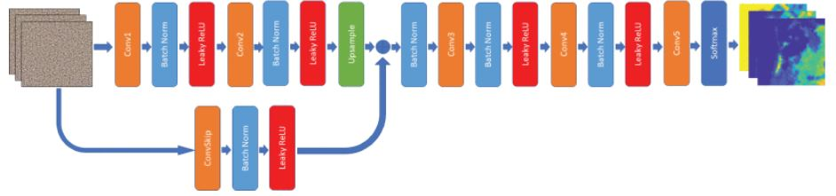

In this article, we introduce a deep learning-based technique for the linear hyperspectral unmixing problem. The proposed method contains two main steps. First, the endmembers are extracted using a geometric endmember extraction method, i.e., a simplex volume maximization in the subspace of the data set. Then, the abundances are estimated using a deep image prior. The main motivation of this work is to boost the abundance estimation and make the unmixing problem robust to noise. The proposed deep image prior uses a convolutional neural network to estimate the fractional abundances, relying on the extracted endmembers and the observed hyperspectral data set. The proposed method is evaluated on simulated and three real remote sensing data for a range of SNR values (i.e., from 20 to 50 dB). The results show considerable improvements compared to state-of-the-art methods. The proposed method was implemented in Python (3.8) using PyTorch as the platform for the deep network and is available online:

Figure 1.** Schematic of UnDIP. UnDIP maps a random noise input image Z to A^ using a deep network fθ such that A^=fθ^(Z) . To estimate the network’s parameters θ^ , UnDIP starts with randomized weights ( θ0 ) and optimizes θ iteratively by computing the gradient of the loss function (10), which utilizes the endmembers (E), extracted by SiVM.

Figure 2.** **Proposed convolutional network architecture with one skip connection. This network is used as fθ for UnDIP in the experiments. Different layers in the network are shown with specific colors.

