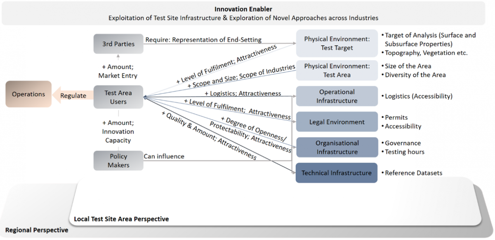

Natural test sites are resource-intensive and often limited to single industries or technologies. Drawing upon two strands of research into technology development and innovation strategies, the research question in this paper investigates how converging test sites may provide opportunities for multiple industries and regions. The paper analyzes multi-industrial test sites regarding, (i) the requirements of the social and physical environment, logistic requirements, as well as technical requirements, (ii) the added value for technology developers, as well as, (iii) the absorptive capacity of the region. Qualitative and quantitative research designs were adopted to analyze multi-industrial test sites. The results indicate that the suitability of multi-industrial test sites depends on the market and research fit of the test target, the quality of the benchmark data, as well as logistical, organizational, legal, social, and ecological factors. The study shows that multi-industrial test sites increase and strengthen the absorptive capacity of regions. Additionally, the study discusses managerial and political implications of multi-industrial test sites. Until now corporate and public test site practices have received only scant recognition in technology management literature, a gap closed by this paper.

Figure 1. **Integrated Test Site Requirements

Figure 2. **Integrated Test Sites, Interplay and Boundary Conditions

