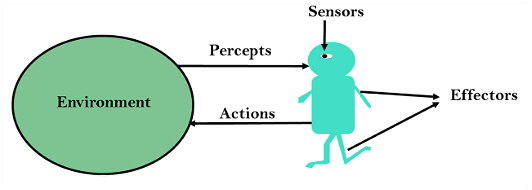
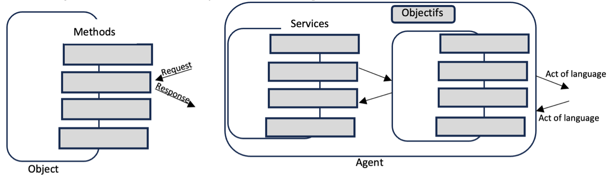

By Mariam Tiotio Berthé and Wilfried Yves Hamilton Adoni

Abstract

Today's technologies, and artificial intelligence in particular, have brought many changes to many disciplines over the years. It has made it possible to increase productivity and reduce operating costs in many sectors. Multi-agent systems belong to the field of artificial intelligence, and have received a great deal of attention from researchers in various disciplines. This discipline is at the crossroads of several fields, in particular artificial intelligence, distributed computing systems and software engineering. As systems that are understood very differently from conventional computer engineering, they come into play where conventional computer-based problem-solving has its limits. Multi-agent systems enable complex problems to be solved by breaking them down into smaller tasks. Tasks are assigned to autonomous entities called agents. Each agent decides on an appropriate action to solve the task using multiple data. This article presents a comprehensive survey of all aspects of MAS, from definitions, characteristics, communications and applications to the challenges of multi-agent systems. A recommendation for implementing MAS is provided, as well as references for further study. We hope that this article will provide an enlightening and comprehensive resource on multi-agent systems for researchers and practitioners in this field.

1) Introduction

In today's world, the growing need to emulate the behavior of real-world applications for effective management and control has necessitated the use of advanced computational techniques. Computational intelligence-based techniques that combine a variety of solutions to problems are becoming increasingly ubiquitous [10].

Artificial intelligence being a very vast field its objectives are really concrete and its main goal is to endow machines with capabilities usually attributed to human intelligence. Distributed Artificial Intelligence (DAI) is a branch of AI, and in recent years it has received an enormous boost because of its ability to solve complex computational problems [2] [3]. Parallel AI, Distributed Problem Solving (DPS) and Multi-Agent Systems (MAS) are the three categories of distributed artificial intelligence based on fundamental methods for solving tasks [4]. The realization of n autonomous intelligent agents that can adapt to dynamic environments is one of the fundamental parts of multi-agent systems.

The basis for research in the discipline of multi-agent systems (MAS) is the results of distributed computing, in which research into interactions and coordination between agents in order to solve a problem was a preoccupation. MAS technology has developed in recent years to address the limitations of classical artificial intelligence, the need for high-performance simulation modeling techniques and robotics [6].

Multi-agent systems offer a new approach to computer science. Several existing review articles present relatively narrow research on Multi-Agent Systems [2]. However, since they can be used in many areas, from the main basic characteristics, research challenges [1], application domains and implementation methodologies, researchers need to have a broad knowledge of Multi-Agent Systems. It is therefore necessary to have a comprehensive and well-detailed resource on the Multi-agent concept.

The particularity of multi-agent systems lies in the fact that they are composed of autonomous entities called agents, sharing the same resources and seeking to achieve their objectives [5]. As with computer entities in DPS [2], collaborating agents can efficiently solve tasks. As a result, in a multi-agent system, everything is distributed and distributed out, and MAS are well suited to complex, open systems.

The aim of this study is to clearly highlight all aspects of multi-agent systems, so that we know where to start and how to go about implementing this type of system. In this article, we provide an overview of Multi-Agent Systems that will enable the reader to gain a thorough understanding of this vast discipline. To do this, we start with a first chapter in which we describe the fundamental element of MAS, namely agents, their characteristics, typologies and architectures, in order to clearly differentiate MAS from other related concepts such as expert systems.

2) Agents

Before we start talking about multi-agent systems, it's important to focus on agents, which are in a sense the fundamental building blocks of any multi-agent system. Agents have been used not only in knowledge-based systems, robotics, natural language and other areas of artificial intelligence, but also in disciplines such as philosophy and psychology [12]. Today, with the advent of new technologies and the expansion of the Internet, this concept is still associated with several new applications such as resource agent, broker agent, personal assistant, interface agent, ontological agent, etc.

In this section, we define agents and their main characteristics. Then we'll give an overview of agent typologies and their architecture. As in all promising fields, the term agent is used rather loosely. To date, researchers in the field of artificial intelligence have been unable to agree on a consensual definition of the word "agent". And there are multiple definitions for agents, resulting from various application-specific characteristics. Definitions of the word agent are all similar, but differ according to the type of application for which the agent is designed. According to M. Wooldridge in [13] *''an agent is a computational entity, such as a computer program or a robot, which can be seen to perceive and act autonomously on its environment*''. Russell and Norvig in [8] define an agent as "*a flexible autonomous entity capable of perceiving the environment through the sensors connected to it*".

In addition to this definition, in [9] we have another definition that could be described as strong in the concept of agent, which takes on its full importance. As shown in Figure 1, an agent is defined as a physical or virtual entity:

Is capable of acting in an environment.

Can communicate directly with other agents.

Is driven by a set of tendencies (in the form of individual objectives or a satisfaction or even survival function, which it seeks to optimize).

Has its own resources

Is capable of perceiving its environment (albeit to a limited extent).

Has only a partial representation of its environment (and 'possibly none at all).

Possesses skills and offers services, can 'eventually reproduce itself.

Figure 1. Agent's capability

Whose behavior tends to satisfy its objectives, taking into account the resources and skills at its disposal, and depending on its perceptions, representations and the communications it receives[9]. Many researchers are also building on existing definitions to bring out new ideas about the agent concept. So, as a further definition in this article, the researchers in [11] draw on Russell and Norvig's information in [8] to define an agent as "an encapsulated computational system that resides in an environment and is capable of acting flexibly and autonomously in that environment to achieve its design goal". To illustrate the above definitions, here are some examples of agents:

A web crawler whose objective is to index content for a search engine, by browsing websites and analyzing semantic content.

A biological vims whose objective is to reproduce in its environment, using cells and their resources.

It's also important to note that an agent is not an object. While the concept of an agent as a distributed object is very similar to that of an object, there is a major difference between the two. Objects have no communication language, no goals, no satisfaction-seeking, the mechanism for sending messages is reduced to a procedure call, and interactions between them are left to the programmer. In [6], an object is defined by the set of services it offers (its methods), which it cannot refuse to perform if requested to do so by another object. Agents, on the other hand, have goals that give them autonomy of decision with regard to the messages they receive. As a result, an agent can be considered as an object with additional capabilities.

Figure 2. Object vs. Agent

3) Agent Ecosystem

3.1 Capability

It's also worth noting that we're not talking about intelligent agents here, just agents. For M. Wooldridge, ''an agent is considered intelligent when it exhibits properties of autonomy, social adaptability, reactivity and proactivity'' [13].

1. **Reactivity**: the intelligent agent must react within a reasonable time to changes in the environment.

2. **Pro-action**: the intelligent agent takes the initiative to behave towards a specific goal.

3. **Sociability**: the intelligent agent must be able to interact and collaborate with other intelligent agents.

Some of the most important characteristics of an intelligent agent are autonomy, action, perception and communication.

3.2 Environment

The environment therefore plays a very important role in an agent's behavior. The environment is the universe in which the agent evolves, performs tasks and receives information. The agent uses the information captured in the environment to make decisions. The environment has multiple characteristics that influence the complexity of an agent-based system [2].

In the agent concept, when we speak of environment, we mean task environment. And these task environments are problems that agents have to solve. Let's start by looking at how to clearly define a task environment, using the PEAS (Performance, Environment, Actuators, Sensors) approach. According to [14], when we want to specify the environment of a task, we need to specify within it the agent's performance measure, environment, sensors and effectors. The acronym PEAS is used to describe this specification of the task environment.

The number of possible environments is very large. The environment has multiple characteristics that influence complexity according to the system [2], but it is possible to categorize them according to four properties:

1. **Accessible**: An accessible environment is one in which the agent can obtain complete, timely and accurate information on the state of the environment. The more accessible an environment, the less complicated it is to create agents to operate in it. Most moderately complex environments are inaccessible.

2. **Deterministic**: This refers to the predictability of the results of an action. In a deterministic environment, results are predictable. More reasonably, however, complex systems are non-deterministic. The state that will result from an action is not guaranteed, even when the system is in a similar state before the action is applied.

3. **Dynamic**: Changes that occur independently of actions by one agent in the environment, while another agent is deliberating.

4. **Discrete/continuous**: When the states of an environment are distinct, even if there are an infinite number of them, the environment is discrete. However, a continuous environment affects the agent's state via a continuous function. For example, a game of chess is a discrete environment, while driving a cab is an example of a continuous environment.

5. **Observable**: If an agent sensor can detect or access the complete state of an environment at any instant, then it is a fully observable environment, otherwise it is partially observable. A fully observable environment is easy because it is not necessary internal state to track the history of the world. An agent without sensors in all environments, then such an environment is called unobservable.

4) BDI Architecture

In the context of practical, state-aware reasoning, researchers have developed a number of architectures for building agents, especially computer agents. Most of these architectures are based on a theory, and the one we'll look at in this section is the most popular. This is the BDI architecture, developed by researchers [12,9,7], the BDI architecture (Belief, Desire, Intention) is an architecture built around practical reasoning. According to [15], BDI architecture is an architecture model for agents based on three concepts, or mental attitudes, namely belief, desire and intention.

Belief **: An agent's beliefs are the information the agent possesses about the environment and about other agents that exist in the same environment. Beliefs can be incorrect, incomplete or uncertain and, because of this, they are different from the agent's knowledge, which is information that is always true. Beliefs can change as the agent, through its perceptive capacity or interaction with other agents, gathers more information. Beliefs are stored in a database (sometimes called a belief base or belief set), although this is an implementation decision.

Desire** : An agent's desires represent states of the environment, and sometimes of itself, that the agent would like to see realized. They represent goals or situations that the agent would like to achieve or provoke. An agent may have contradictory desires; in this case, he must choose a consistent subset of his desires. This consistent subset of desires is sometimes identified with the agent's goals.

Intention** : An agent's intentions are the actions the agent has decided to take to fulfill his desires. Even if all an agent's desires are consistent, the agent may not be able to fulfill all its desires at once. In implemented systems, this means that the agent has started to execute a plan. Plans are sequences of actions (recipes or knowledge areas) that an agent can perform to realize one or more of its intentions. Plans can include other plans: my plan to drive may include a plan to find my car keys.

The BDI theory of rational action, first proposed by Michael Bratman of Practical Reasoning, attempts to capture how people reason in everyday life, deciding at any given moment what to do. In developing his theory, Bratman shows that intentions play a fundamental role in practical reasoning, as they limit the possible choices a human (or rational agent) can make at any given moment.

The objective of each agent is to solve the task it has been assigned, with certain additional constraints. An example of a simple agent is given by M. Wooldridge, and it is a tropical agent, therefore with a reflex behavior, that everyone has already met: a thermostat [18]. A thermostat is a control system for managing room temperature. Today's programs interact with their user according to a paradigm known as direct manipulation. In other words, the program does exactly what the user asks it to do [19]. Applications of such agents can be found mainly in e-mail readers, active newsgroup readers and active browsers. The case of web services is also very common, as they are used every day. These agents are purely software, in a computer environment.

Robotic vacuum cleaners are an example of a consumer application for autonomous agents designed to fulfill a specific purpose. For example, to clean the house by vacuuming alone. To do this, we use an autonomous vacuum cleaner capable of moving around its environment (the rooms in a house), feeding itself (recharging its batteries), and knowing when and where to clean.

In fact, the agent as an individual entity may prove limited in many cases, especially in view of what we see today as distributed applications for which a set of agents pooling skills and knowledge seems more than necessary. These types of agents form what are known as multi-agent systems.

5) Multi-Agent System

Unlike AI systems, which simulate to some extent the capabilities of human reasoning [1], multi-agent systems (MAS), with entities possessing flexibility and autonomy, have been widely studied for analyzing and simulating complex systems in recent years. [ 16 , 17].

According to [2], a multi-agent system (MAS) is made up of a set of computer processes running at the same time, i.e. several agents living at the same time, sharing common resources and communicating with each other. The key to multi-agent systems lies in the formalization of coordination between agents. Agents capable of communicating, grouped together as a community, enable numerous interactions and the performance of multiple tasks. These interactions give rise to organized structures within this community of agents [9].

A multi-agent system is made up of a set of elements [1,9]:

An environment E, i.e. a space in which the agents are located and which generally has a metric.

A set of objects O. These objects are situated and passive, i.e. for any object it is possible, at a given moment, to associate a position E. They can be perceived, created, destroyed and modified by the agents.

A set A of agents, which are particular objects that represent the system's active entities.

A set of relations R, which link objects (and therefore agents) together.

A set of operations Op enabling agents to perceive, produce, consume, transform and manipulate objects.

6) Conclusion

By doing some time-consuming and difficult tasks on behalf of systems or users, intelligent agents facilitate work. Certain chores may now be automated thanks to these agents.

There will be a greater creation of intelligent agents as technology advances. Complex AI-driven gadgets that address today's global concerns will result from this. There doesn't appear to be any end to this fascinating technology.

References

[1] Russell, S.; Norvig, P. Intelligence artificielle : une approche moderne , 3e éd. ; Prentice Hall Press : Upper Saddle River, NJ, États-Unis, 2009.

[2] M. Wooldridge, An introduction to multiagent systems. John Wiley & Sons, 2009.

[3] A. H. Bond and L. Gasser, Readings in distributed artificial intelligence.Morgan Kaufmann, 2014.

[4] A.Diori, S. Kanhere, R. Jurdak. Multi-Agent Systems: A survey 2018

[5] V. Julian, V. Botti. Multi-Agent Systems 2019

[6] M. Bratman. Intention, plans, and practical reason. Harvard University Press, 1987.

[7] M. Bratman, D. Israel, and M. Pollack. Plans and resource bounded practical reasonning. Computational Intelligence, 4 :349-355, 1988.

[8] S. Russell, P. Norvig, and A. Intelligence, “A modern approach,” Artificial Intelligence. Prentice-Hall, Egnlewood Cliffs, vol. 25, p. 27, 1995.

[9] FERBER J. Les Systèmes multi-agents. InterEditions, 1995.

[10] L. C. Jain and D. Srinivasan, Innovations in Multi-agent Systems and Applications. Springer, 2010.

[11] D. Ye, M. Zhang, and A. V. Vasilakos, “A survey of self-organization mechanisms in multiagent systems,” IEEE Transactions on Systems, Man, and Cybernetics: Systems, 2016.

[12] B. Chaib-draa, I. Jarras et B. Moulin, Systèmes multiagents : Principes généraux et applications 2001

[13] Wooldridge, M. 1999. « Intelligent Agent », Multiagent Systems de Weiss G. , Cambridge, The MIT Press.

[14] Russell, S., et Norvig, P. 2006. Intelligence artificielle, 2 eme édition, France : Pearson. ---1

[15] A. S. Rao and M. P. Georgeff. Modeling rational agents within a BDI-architecture. In R. Fikes and E. Sandewall, editors, Proceedings of Knowledge Representation and Reasoning (KR&R-91), pages 473-484. Morgan Kaufmann Publishers : San Mateo, CA, April 1991

[16] Nguyen, T.T.; Nguyen, N.D.; Nahavandi, S. Deep Reinforcement Learning for Multiagent Systems: A Review of Challenges, Solutions, and Applications. IEEE Trans. Cybern. 2020, 50, 3826–3839. [Google Scholar] [CrossRef] [PubMed][Green Version]

[17] Dorri, A.; Kanhere, S.S.; Jurdak, R. Multi-Agent Systems: A Survey. IEEE Access 2018, 6, 28573–28593.

[18] Wooldridge, M. 1999. « Intelligent Agent », Multiagent Systems de Weiss G. , Cambridge, The MIT Press.

