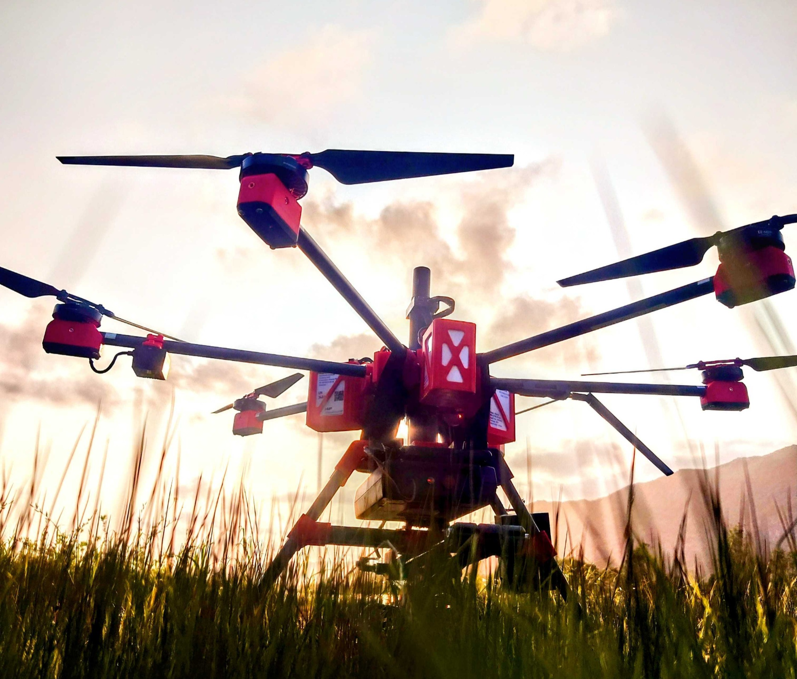
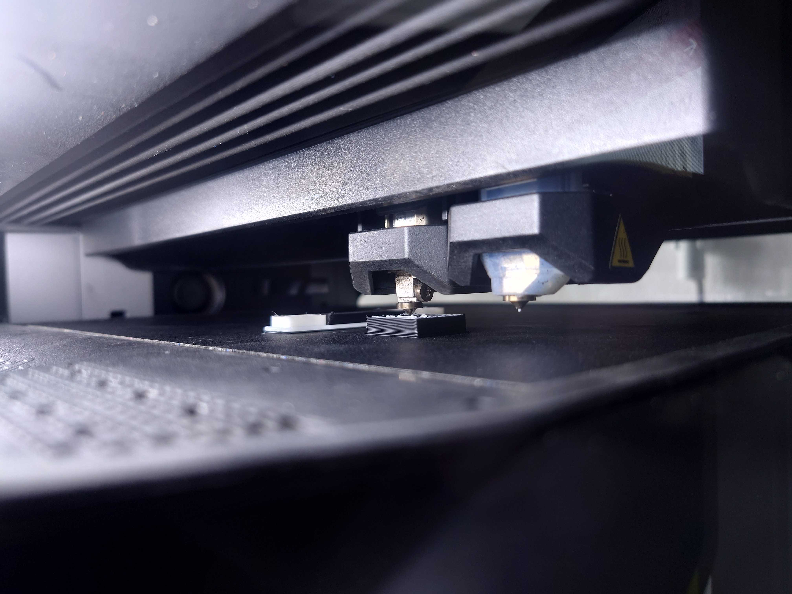

*How 3D printed parts are perfected, and used in manufacturing of light & heavy weight multirotor aircrafts. **Description: 3D printed Drone used for a Survey in Norway
Photo : Junaidh Shaik Fareedh

This Topic is going to be written in multiple posts, Please don't forget to check the Post Edition number to keep yourself updated.

In Recent History 3D printing has changed Rapid Prototyping as never before, things that take weeks to be made in conventional methods can be done in hours using 3dPrinters. To explain briefly what 3D printing is, let me give you few commonly known definitions, 3D printing also known as additive manufacturing, is a process of creating three-dimensional objects by layering or adding materials together based on a digital design. It enables the production of complex geometries and intricate structures that are difficult or impossible to achieve with traditional manufacturing methods.

So I use these 3D printed parts to make mechanical holding mounts, joints and Covering units to help building a strong yet light weight drone that has its base skeleton(Structure) made of Carbon Fiber materials, About which, I will be posting in the near future- So keep Checking our Blogs.

3D printing **

Here are some key points about 3D printing:

1. *Process:* The 3D printing process typically begins with creating a digital 3D model using computer-aided design (CAD) software or by scanning an existing object using a 3D scanner. The model is then sliced into thin cross-sectional layers. These layers serve as a blueprint for the 3D printer to build the object layer by layer.

2. *Materials:* A wide range of materials can be used for 3D printing, including plastics, metals, ceramics, resins, and composites. Each material has its own properties and applications. Some common 3D printing technologies include fused deposition modeling (FDM), stereolithography (SLA), selective laser sintering (SLS), and direct metal laser sintering (DMLS).

3. *Applications:* 3D printing has diverse applications across various industries. It is used in rapid prototyping, where designers and engineers create physical prototypes to test and validate their designs before mass production. It is also employed in custom manufacturing, enabling the production of personalized items such as jewelry, prosthetics, and dental implants. Additionally, 3D printing finds applications in aerospace, automotive, healthcare, architecture, education, and consumer goods sectors.

4. *Advantages:* 3D printing offers several advantages over traditional manufacturing methods. It allows for design freedom, where complex shapes and internal structures can be easily fabricated. It also reduces material waste as objects are built layer by layer, using only the necessary amount of material. Additionally, 3D printing enables on-demand manufacturing, customization, and rapid prototyping, leading to faster development cycles and cost savings.

5. *Limitations:* While 3D printing has numerous benefits, it also has some limitations. The speed of 3D printing can be relatively slow compared to traditional manufacturing processes, especially for large and complex objects. The quality and strength of printed parts may vary depending on the technology and materials used. Furthermore, the cost of 3D printers, materials, and post-processing equipment can be a barrier to widespread adoption.

Overall, 3D printing is a transformative technology with a wide range of applications and potential for innovation in various industries. But here at ***Helmholtz Institute Freiberg*** we use the 3D printer mostly to build drone parts, spare parts and small structures that are too complex to be made using any other method.

Description: 3D printing with MakerBot Method X with Dual Extruder
Photo : Junaidh Shaik Fareedh

## **Next Post: Material used in 3d Printing

In the Next post 2, I will give the materials and its properties, why we use them in our aircrafts and how we have Chosen the materials after years of experience in the field.

Signing off for Today: JSF

