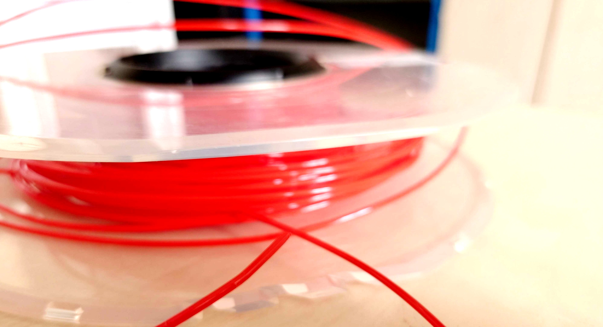
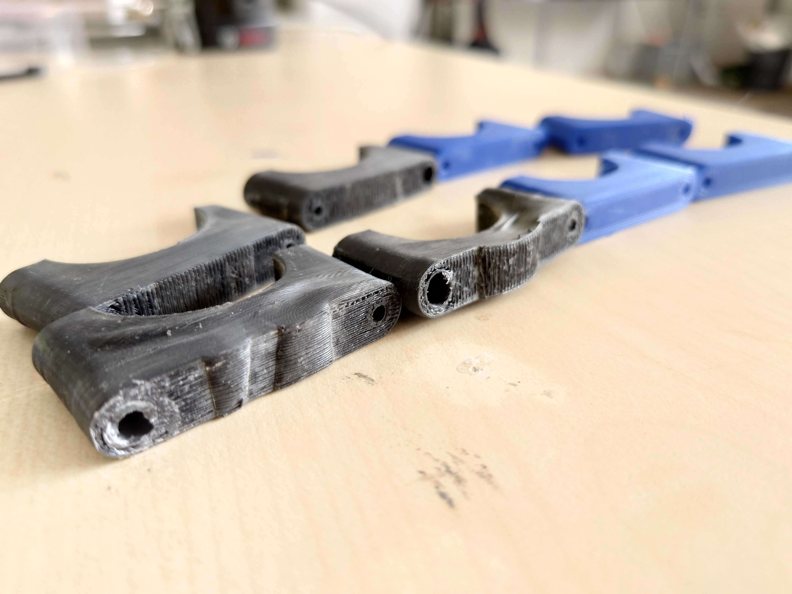
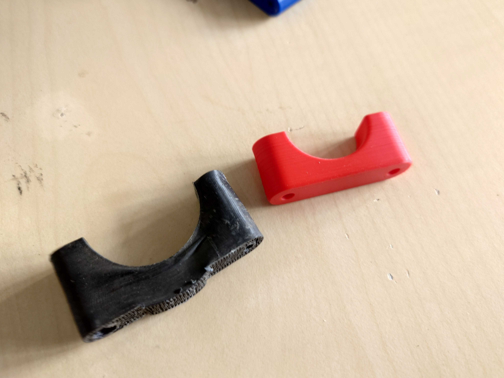

By Junaidh Shaik Fareedh.

FDM printing at 1.75 mm. Daily materials in the DroneLab are ABS, PETG and Onyx Tough. ABS holds up better to UV and heat than MakerBot Tough (a PLA–nylon blend), which deforms in the sun.

