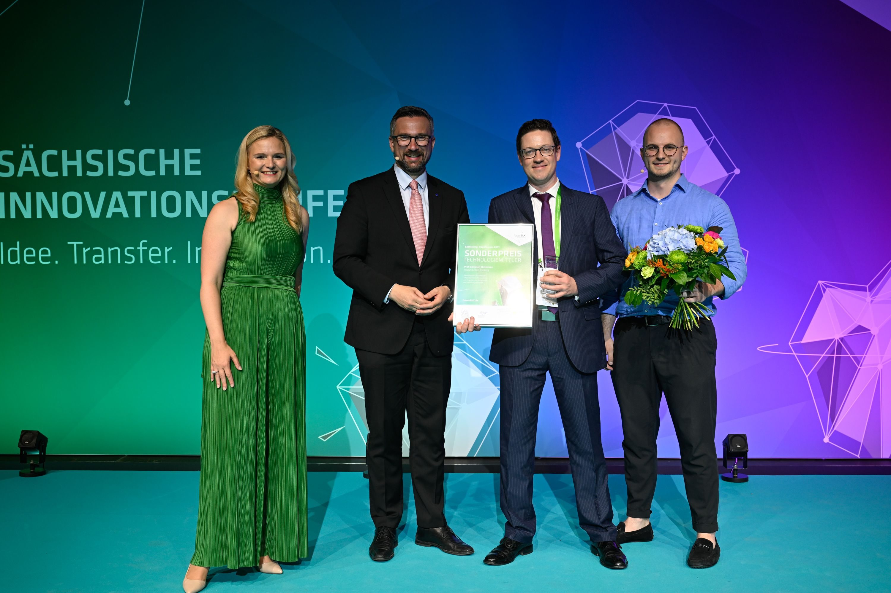

The innovation of [Theiax](http://www.theiax.de) was rewarded not once but twice during the Saxon Innovation Conference on July 4th 2023.

"Bringing promising research results into application is what distinguishes successful transfer. Dr Richard Gloaguen, a scientist at the Helmholtz Institute Freiberg for Resource Technology (HIF), an institution of the Helmholtz Centre Dresden-Rossendorf (HZDR), and his team have succeeded in doing just that. The researchers developed novel, digital mapping methods for sustainable resource exploration and extraction. With their spin-off company TheiaX, they have been offering the technologies on the market for almost two years with steadily increasing demand. The start-up is now the leading innovation driver in the field of spectral exploration. The French researcher was awarded second place in the Saxon Transfer Prize for the successful transfer process. As an outstanding technology mediator, TheiaX managing director Christian Christesen received a special transfer prize." ([HZDR PR](https://www.hzdr.de/db/Cms?pNid=99&pOid=69614))

Richard Gloaguen receiving the award

Christian Christesen receiving his award

Full list of recipients: [here](https://www.smwa.sachsen.de/blog/2023/07/05/saechsische-staatspreise-fuer-gruenden-transfer-und-innovation-die-gewinner-stehen-fest/)

