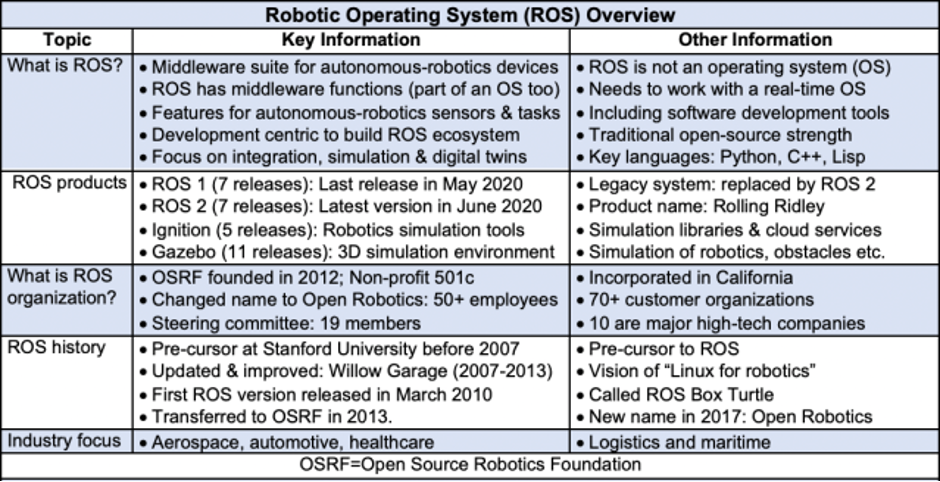
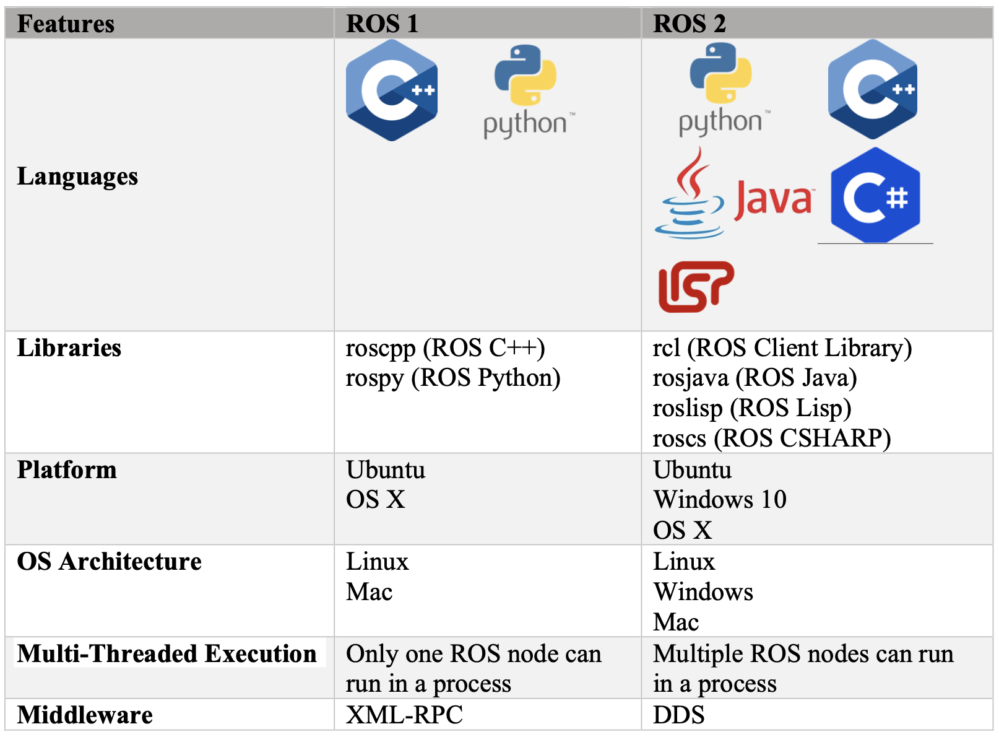
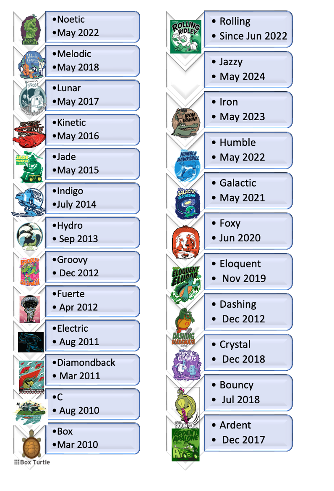

By Wilfried Yves Hamilton Adoni

Over the last decade, several areas of the robotics industry including developer community have embraced open source software, particularly Linux-based programming. In this article, we will concentrate on an open framework known as **R**obotic** O**perating **S**ystem (ROS). ROS has been around for over a decade and is rapidly being utilized by developers of autonomous vehicles. It is a software platform for creating systems and applications for robotics and it encompasses all sorts of autonomous systems, including terrestrial, aerial, and seaborne systems. It offers services for a heterogeneous computer system, such as hardware abstraction, low-level device control, implementation of widely used functionality, message transmission between tasks, and managing packages.

With the release of ROS 2, the issue now become which version of ROS to choose for the implementation of new robotic projects has been raised. While ROS 1 and ROS 2 share essential functionality, there are several variations between the two. We shall refer to "ROS 1" and "ROS 2" for consistency in this text, acknowledging that style and naming convention are still evolving. For the sake of consistency, we shall refer to "ROS 1" and "ROS 2" in this post, understanding that style and naming convention are still evolving. We will attempt to position some of these distinctions in the perspective of what they signify for you and your robotics project.

ROS is not an operating system** since it cannot manage or control hardware resources, which is a core function of an operating system. Instead, ROS interacts with an operating system, ideally one that runs in real time.

ROS contains several functionalities found in middleware. ROS middleware is dedicated to the development of a software ecosystem for autonomous and robotics devices. This development-focused strategy capitalizes on open-source development's conventional capabilities. The ROS ecosystem's software can be classified into three categories:

Tools for building and distributing ROS-based software that are agnostic of language and platform. It means that the basic communication characteristics used to communicate between nodes do not rely on a language, but rather on a lower layer.

ROS client library implementations for popular programming languages like as C++ (the framework's core language), Python (high level language), and Lisp (assembly language). Since it is agnostic, you can absolutely implement a C++ node that passes data to another Python node.

Packages containing application-specific code that makes use of one or more ROS client libraries. The table below provides key information of ROS overview.

Source: Egil Juliussen, Jan 2022

Despite the significance of responsiveness and low latency in robot control, ROS is not an RT Operating System (RTOS). However, it is feasible to connect ROS with real-time computer programs. The absence of resources for real-time systems has been tackled with the development of ROS 2, a significant redesign of the ROS API that will take use of contemporary libraries and technologies for basic ROS tasks and include capability for real-time coding and embedded system hardware.

If you're a robotics organization considering about migrating, or a startup getting started, we've compiled a list of the key changes between ROS 1 and ROS 2. Many robotics teams are debating whether to upgrade from ROS 1 to ROS 2. There isn't much text that highlights the major differences between both versions.

The first version of ROS1 is released since 2007, and it provides the software tools for users who need to R&D projects with the PR2 advanced research projects also designed ROS to be useful on other robots. The robust community has amassed rich and stable packages, debugging tools, and a comprehensive tutorial to assist novices in quickly understanding the use cases and methodologies of ROS. Whereas ROS 2, officially released in 2017 to face the new requirements of robot security, real-time controlling, and the distributed processing. It has fewer dependencies, improved portability, reliability, and durability. The table below presents the major differences between ROS 1 and ROS 2.

ROS 2 does not have backward compatibility with ROS 1. As a result, ROS 1 packages will most likely not function with ROS 2 and will need to be reworked, and other software you're used to utilizing with ROS 1 may no longer work. While this is presently a serious constraint, solutions such as ROSbridge are allowing advancements. ROS 1 was designed primarily for Ubuntu. ROS 2 is compatible with MacOS, Windows and Ubuntu.

ROS releases may be incompatible with previous distributions, and they are frequently identified by code name as opposed to version number. ROS is presently updated once a year in May, with the distribution of Ubuntu LTS versions. ROS 2 is presently updated every six months (approximate December and July). These releases are only supported for one year. Currently, two main versions are being released: ROS 1 and ROS 2. Aside from that, from at least 2012, there has been the ROS-Industrial or ROS-I derivate project. ROS 1's most recent release, Noetic, has an EOL (end of life) date of May 2025, after which Open Robotics will discontinue support and focus only on ROS 2. It should be emphasized, however, that additional tools and packages will be introduced in the coming years until its demise.

ROS 1 is currently being CI tested solely on Ubuntu. The community actively supports it on various Linux varieties as well as OS X. ROS 1 employs a proprietary serialization format, a proprietary transport protocol, and a proprietary central discovery method. While ROS 2 is now being CI tested and supported on Ubuntu Xenial, OS X El Capitan, and Windows 10 (for more information, see [http://ci.ros2.org/ci.ros2.org](http://ci.ros2.org/ci.ros2.org)). ROS 2 features an abstract middleware interface that provides serialization, transport, and discovery. The DDS standard is currently used in all implementations of this interface. This enables ROS 2 to provide a variety of Quality-of-Service rules that improve communication across multiple networks.

ROS Implementation Case Study and ChallengesOverall, whereas ROS 1 was built for academic applications, ROS 2 was primarily designed for commercial ventures as technology has grown more inexpensive and widely available in recent years. The contributor community's growth of open-source libraries aided in the expansion of industrial applications for ROS 1, which aided in the creation of additional capabilities in ROS 2.

The example below shows how to use the interoperability benefits of ROS 2 with the DDS (Data Distribution Service) open middleware standard when managing tasks using a software implementation named Orchestrator. The illustration below shows how MTConnect ([https://www.mtconnect.org/](https://www.mtconnect.org/)) might be used as a basis to increase information exchange amongst assets. The data model that represents production data is provided by MTConnect, while ROS 1 or ROS 2 flow throughout a manufacturing system.

Source: https://www.swri.org/industry/industrial-robotics-automation/blog/the-ros-1-vs-ros-2-transition

However, certain ROS 1 functionality have yet to be fully moved over to ROS 2. For example, a MoveIt([https://moveit.ros.org/](https://moveit.ros.org/)) setup assistance, a popular motion planning framework connected with ROS, is presently only available for ROS 1, with a ROS 2 release promised in the future. Furthermore, documentation for ROS 2 packages is currently sparse as compared to ROS 1. Because ROS 1 is currently relatively established, developers will be able to proceed more quickly through the creation of their projects because many of its capabilities are ready to use and fully documented. ROS 1's growth and success were aided through training and documentation. The infrastructure for teaching and documenting ROS 2 is still in its early stages.

Overall, ROS 1 is still a recognized standard for academic and industrial robotics projects. The shift to ROS 2 is gathering momentum as use cases demonstrate capacity.

ROS 2 should be used by developer teams starting from scratch, because official support for ROS 1 ends in 2025.

For developers who utilize it, they will be unable to upgrade it permanently. However, every robot application that is currently utilizing ROS 1 has various concerns when deciding when and how to move to ROS 2. Community should collaborate to determine the amount of effort and manpower required to transition, as well as a timetable for carrying out the plan in accordance with corporate goals and the product development cycle.

References

[Thomas, D.](https://github.com/dirk-thomas) *Changes between ROS 1 and ROS 2, http://design.ros2.org/articles/changes.html.

Gerkey, B. Why ROS 2.0?

Willow, [G. PR2: Advanced research robots](https://robotsguide.com/robots/pr2), http://design.ros2.org/articles/why_ros2.html

ROS 1 vs. ROS 2: Which one is better for me ?, https://www.theconstructsim.com/infographic-ros-1-vs-ros-2-one-better-2/

Tully F., Ken C., https://www.ros.org/reps/rep-0003.html

REP 108, ROS Diamondback Variants, [http://www.ros.org/reps/rep-0108.html](http://www.ros.org/reps/rep-0108.html)

Today Technology, [https://www.swri.org/technology-today/smarter-manufacturing](https://www.swri.org/technology-today/smarter-manufacturing)

The ROS1 vs ROS2 Transition, [https://www.swri.org/industry/industrial-robotics-automation/blog/the-ros-1-vs-ros-2-transition](https://www.swri.org/industry/industrial-robotics-automation/blog/the-ros-1-vs-ros-2-transition)

