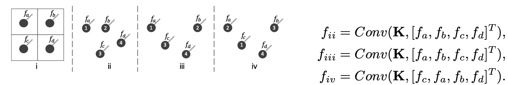
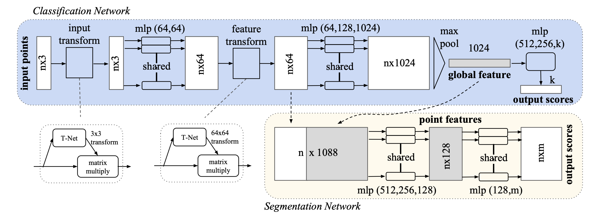
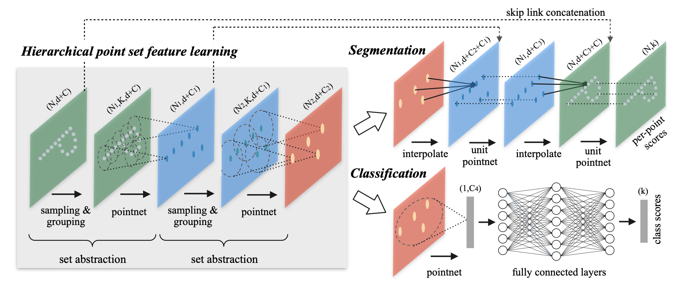
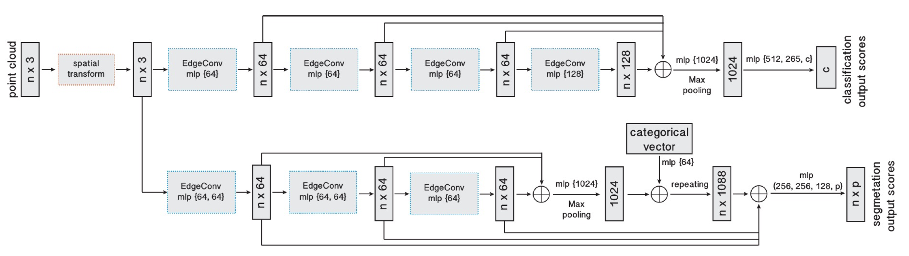
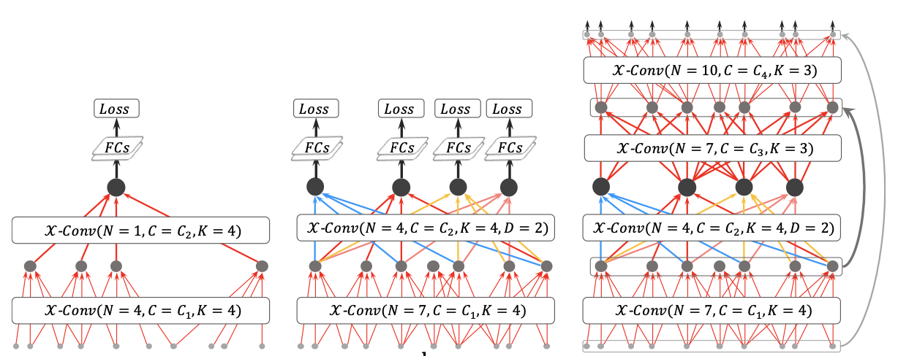
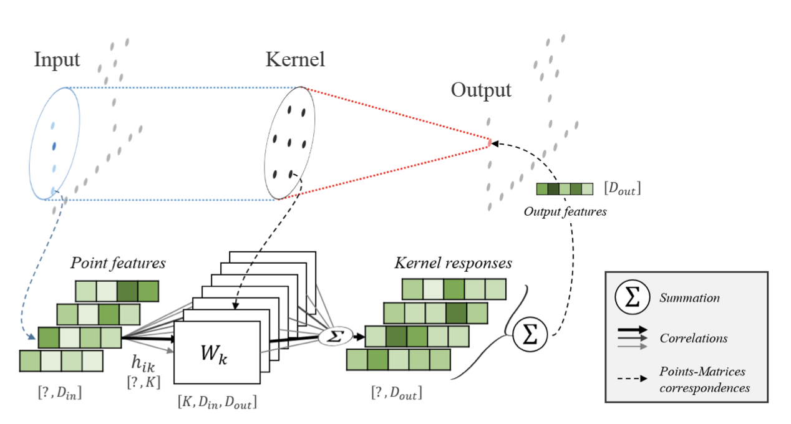
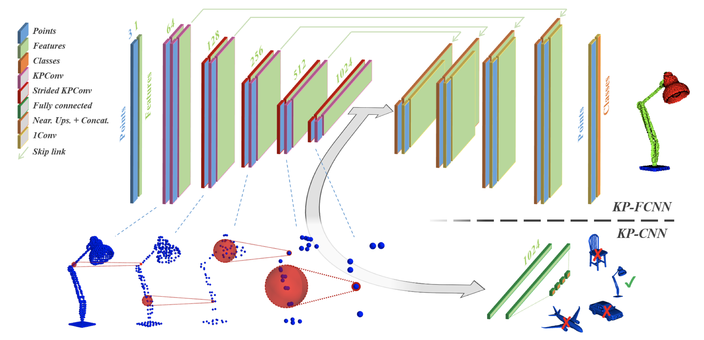
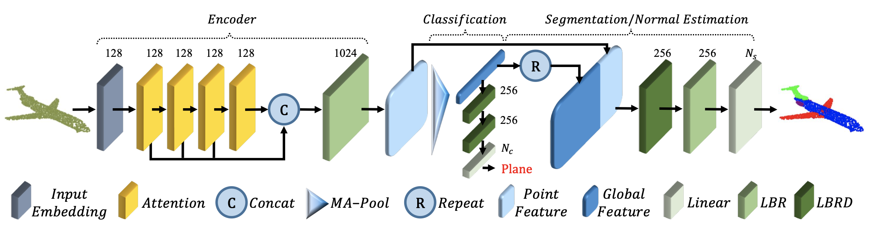
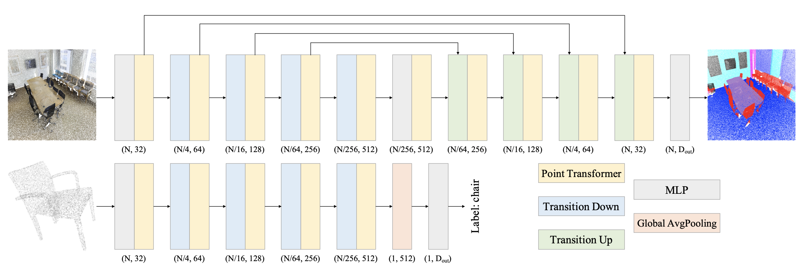

By Aldino Rizaldy.

Point clouds are irregular, unstructured and unordered, which complicates deep learning. Four families dominate recent work:

- **MLP** — PointNet, PointNet++
- **Graph** — DGCNN
- **Convolution** — PointCNN, KPConv
- **Transformer** — PCT, Point Transformer

