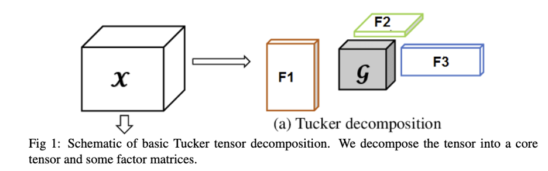
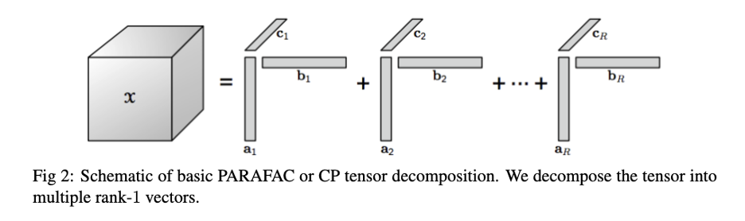

By Samiran Das

Hyperspectral data is extremely useful in remote sensing because it includes rich spectral information that enables accurate classification, target detection, and object detection. Hyperspectral data contains 3 dimensions- two spatial dimensions, and a spectral dimension. The spatio-spectral hyperspectral datacube can be conveniently represented as a tensor of order 3. Remotely sensed hyperspectral images capture a wide range of electromagnetic frequencies. These hyperspectral data are typically represented as multi-dimensional arrays or tensors, where each dimension corresponds to a different spectral band or wavelength.

The tensor or the multiway data can be converted to lower-order tensors, matrices, or vectors by different reordering methods such as reshaping, matricization, unfolding, vectorization, etc. We can multiply tensors with other tensors, matrices, or vectors according to the Kronecker product, Khatri-Rao product, t-product, etc. We can obtain factors from the tensor using tensor decomposition methods, which include tucker decomposition, Canonical Polyadic decomposition (CPD) or PARAllel FACtorization (PARAFAC), tensor ring decomposition, tensor train decomposition, tensor Singular Value Decomposition (SVD), etc. The aforementioned decomposition approaches can be considered extensions of traditional matrix factorization. The decomposition methods require the rank of the decomposition as input and accordingly produce the output. The shape, and size of the factors obtained by this decomposition vary accordingly. These approaches can identify the underlying structure essential for signal separation, latent variable identification, background-foreground identification, dimensionality reduction, data compression, and other tasks. Multiway methods are becoming more and more popular and suitable in various tasks such as computer vision, communication, deep learning, linear algebra, chemometrics, big data analytics, etc. These applications prompted researchers to come up with libraries and software for tensor-based analysis. You can explore n-way, TensorLab, tensor toolbox, and TensorLy to understand how multiway decompositions work.

Among the tensor decompositions, Tucker decomposition, and PARAFAC decomposition are very popular. A brief account of these decompositions is given below-Tucker Decomposition- Tucker decomposition is an extensively used tensor decomposition method, which is suitable for compression, dimensionality reduction, dictionary learning, and other tasks. Tucker decomposition, which is similar to higher-order singular value decomposition, expresses a tensor in terms of a core tensor and some factors. The exact decomposition relies on various parameters.

Canonical Polyadic Decomposition or Parallel Factorization (PARAFAC) Decomposition- PARAFAC or canonical polyadic (CP) has gained popularity in specific tasks such as signal separation, dictionary learning, compression, etc. PARAFAC or CP} decomposition represents a tensor as the sum of the product of rank-$1$ factors. The rank one factors obtained according to the decomposition represent the latent components or signal sources. On the other hand, the number of rank-$1$ components required to represent the data can be interpreted as the number of signal sources present and is often termed the rank of the tensor.

Tensor decompositions help extract valuable information from these complex data sets, and their significance in hyperspectral data processing can be discussed in several aspects:

Dimensionality Reduction: Hyperspectral data often contain a large number of spectral bands, leading to high-dimensional data. Tensor decompositions, such as Tucker decomposition or PARAFAC (Parallel Factor Analysis), can be used to reduce the dimensionality of the data while preserving its essential information. This reduction simplifies subsequent analysis and visualization tasks.

Feature Extraction: Tensor decompositions can extract meaningful features or components from hyperspectral data. These components may represent spectral signatures of different materials high-level spatial features, or spectral characteristics. These spatio-spectral features enable efficient, accurate classification of objects or substances in the environment.

Noise Reduction: Hyperspectral data are susceptible to various sources of noise, including atmospheric interference and sensor noise. Tensor decompositions can help denoise the data by separating the signal components from noise components in a multiview manner. Various tensor decomposition strategies, optimization approaches, and multiway regression methods lead to improved accuracy of subsequent analysis and interpretation.

Unmixing and Endmember Extraction: Hyperspectral unmixing is a critical task in remote sensing, where the goal is to identify the pure spectral signatures (endmembers) of materials present in a mixed pixel. Tensor decomposition methods such as PARAFAC decomposition can identify the endmember patterns. The initial factors obtained by PARAFAC can therefore be used to compute the abundance maps by tensor-based optimization approach.

If you want to explore tensor decompositions and tensor approaches for hyperspectral data processing have a look at the following references.

References:

[1] E. Acar and B. Yener, “Unsupervised multiway data analysis: A literature survey,” IEEE Trans. Knowl. Data Eng., vol. 21, no. 1, pp. 6–20, Jan. 2009.

[2] E. Kofidis and P. Regalia, “Tensor approximation and signal processing applications,” Contemp. Math., vol. 280, pp. 103–134, 2001.

[3] M. Vasilescu and D. Terzopoulos, Multilinear Analysis of Image Ensembles: TensorFaces. Berlin, Germany: Springer-Verlag, 2002, pp. 447–460.

[4] A. Cichocki, D. Mandic, L. De Lathauwer, G. Zhou, Q. Zhao, C. Caiafa, and A. H. Phan, “Tensor decompositions for signal processing applications: From two-way to multiway component analysis,” IEEE Signal Process. Mag., vol. 32, no. 2, pp. 145–163, Mar. 2015.

[5] A. Anandkumar, R.Ge, D. Hsu, S. M. Kakade, and M. Telgarsky, “Tensor decompositions for learning latent variable models,” J. Mach. Learn. Res., vol. 15, no. 1, pp. 2773–2832, Jan. 2014.

[6] T. G. Kolda and B.W. Bader, “Tensor decompositions and applications,” SIAM Rev., vol. 51, no. 3, pp. 455–500, 2009.

[7] P. Comon, “Tensors: A brief introduction,” IEEE Signal Process. Mag., vol. 31, no. 3, pp. 44–53, May 2014.

[8] Oymak, S., & Soltanolkotabi, M. (2018). End-to-end learning of a convolutional neural network via deep tensor decomposition. arXiv preprint arXiv:1805.06523.

[9] Nadav Cohen, Or Sharir, Amnon Shashua, “On the Expressive Power of Deep Learning: A Tensor Analysis”, Proceedings of Machine Learning Research.

[10] Kolda, T. G., & Bader, B. W. (2006). MATLAB tensor toolbox (No. TensorToolbox; 001963MLTPL00). Sandia National Laboratories (SNL), Albuquerque, NM, and Livermore, CA (United States).

[11] Kisil, Ilya, Giuseppe G. Calvi, Bruno S. Dees, and Danilo P. Mandic. “HOTTBOX: Higher Order Tensor ToolBOX.” arXiv preprint arXiv:2111.15662 (2021).

[12] S. Das, “[Hyperspectral image, video compression using sparse tucker tensor decomposition](https://scholar.google.co.in/citations?view_op=view_citation&hl=en&user=1p3HJ-cAAAAJ&citation_for_view=1p3HJ-cAAAAJ:e5wmG9Sq2KIC)”, IET Image Processing, Vol. 15, No. 4, pp- 964-973.

[13] Hao, Liyang, Siqi Liang, Jinmian Ye, and Zenglin Xu. “TensorD: A tensor decomposition library in TensorFlow.” Neurocomputing 318 (2018): 196–200.

[14] Vervliet, N., Debals, O., & De Lathauwer, L. (2016, November). Tensorlab 3.0 — Numerical optimization strategies for large-scale constrained and coupled matrix/tensor factorization. In 2016 50th Asilomar Conference on Signals, Systems and Computers (pp. 1733–1738). IEEE.

[15] Debals, Otto, Frederik Van Eeghem, Nico Vervliet, and Lieven De Lathauwer. “Tensorlab Demos.” (2016).

[16] [https://www.tensorlab.net/](https://www.tensorlab.net/)

[17] [http://tensorly.org/stable/index.html](http://tensorly.org/stable/index.html)

[18] [https://www.tensortoolbox.org/](https://www.tensortoolbox.org/)

[19] [https://pypi.org/project/TensorToolbox/](https://pypi.org/project/TensorToolbox/)

[20] [http://tensornetwork.org/software/](http://tensornetwork.org/software/)

