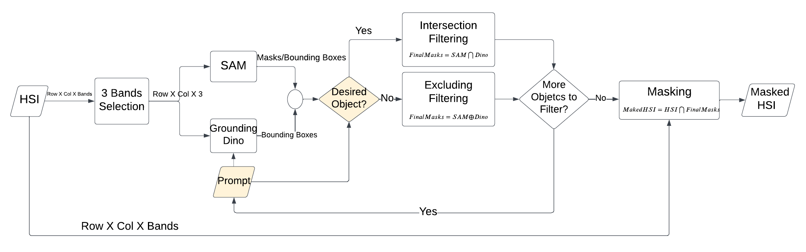
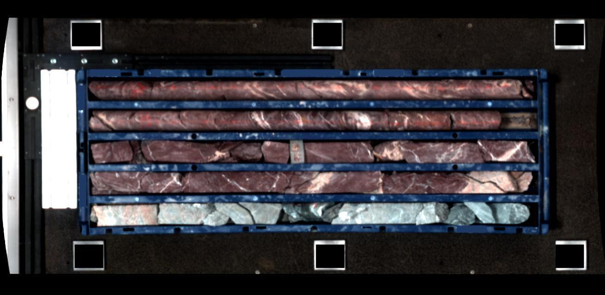
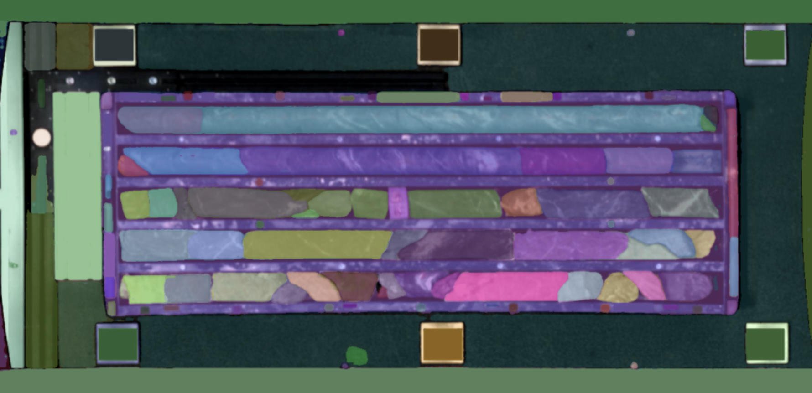
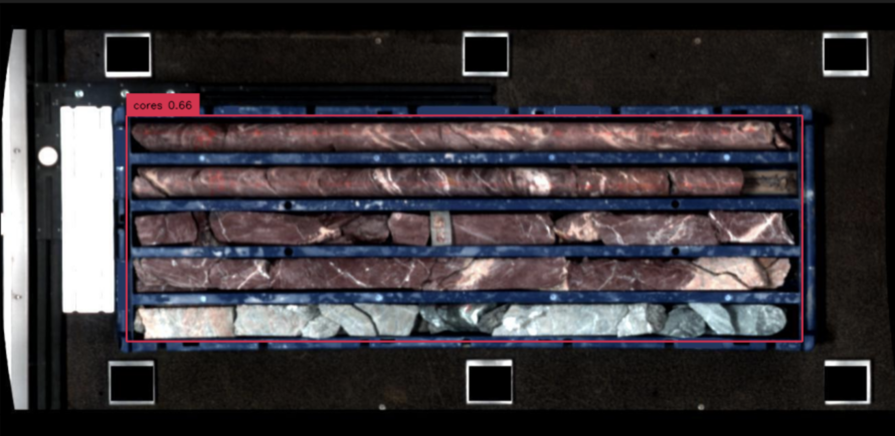
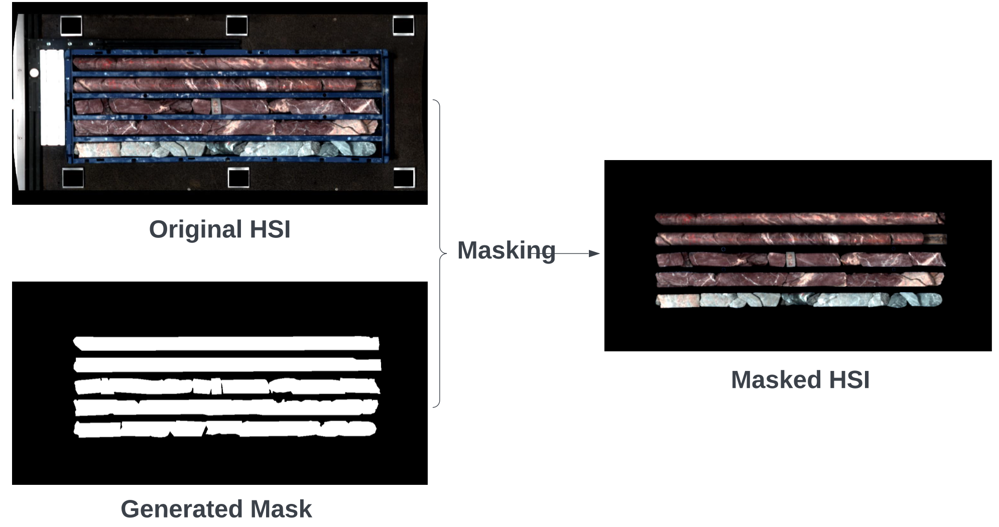

## Masking Hyperspectral Imaging Data with Pretrained Models

By Elias Arbash

The paper is available at: [https://arxiv.org/abs/2311.03053](https://arxiv.org/abs/2311.03053)

### Abstract:

In hyperspectral data cubes, the presence of undesired background areas associated with potential noise and unknown spectral characteristics degrades the performance of hyperspectral data processing. Masking out unwanted regions is key to addressing this issue. Processing only regions of interest yields notable improvements in terms of computational costs, required memory, and overall performance. Our proposed processing pipeline encompasses two fundamental parts: regions of interest mask generation, followed by the application of hyperspectral data processing techniques solely on the newly masked hyperspectral cube. The novelty of our work lies in the methodology adopted for the preliminary image segmentation. By deploying the Segment Anything model (SAM) with Grounding Dino, followed by intersection and exclusion filtering steps, undesired areas are masked out, leaving the hyperspectral cubes containing solely regions of interest without the need for retraining or finetuning.

The methods script is available on:

https://github.com/hifexplo/Masking

### Introduction

In a world where visualizing the unseen is often the key to groundbreaking discoveries, hyperspectral imaging (HSI) emerges as an indispensable technological solution. It unlocks the hidden details of the spectrum, offering a unique perspective that surpasses the capabilities of the naked eye. Hyperspectral imaging, a fusion of spectroscopy and conventional imagery, empowers us to recognize subtle details in the world around us, from diagnosing diseases to scrutinizing soil for optimal agricultural practices.

Fig 1 . RGB vs HSI of PCB **However, to harness the full potential of hyperspectral data, we turn to an equally transformative innovation: Deep Learning (DL). Deep learning, a subset of artificial intelligence, offers the computational prowess to decode the hidden patterns and spectral signatures concealed within Hyperspectral Images (HSI). By leveraging neural networks, deep learning opens doors to applications that were once considered beyond the realm of possibility.

However, the integration of DL on HSI does not come free of complications. Hyperspectral data is a specialized form of remote sensing data that captures an extensive array of electromagnetic wavelengths with a high number of finely spaced spectral bands, typically ranging from hundreds to thousands. This abundance of spectral information results in an enormous dataset characterized by a multitude of variables. The large volume and complexity of hyperspectral data pose a challenge for the convergence of mathematical models like machine learning algorithms, as the complexity within the data can hinder the development and training of effective models.

In HSI, the existence of undesired background can hinder the performance of mathematical models like dimensionality reduction models e.g., Principal Component Analysis (PCA) and DL ones. Let's elaborate more on this part:

Dimensionality reduction**: methods like PCA build upon calculating the mean of the values in the hyperspectral scene, and having a large area of irrelevant background means having many pixels skewing this calculation, therefore, yielding impaired desired-objects representative principal components. In other words, these extra vectors of undesired objects or backgrounds exert a negative impact on the new representation of the object of interest in the hyperspectral scene. Excluding the background from the calculations enhances the indicative principal components.

Machine learning models**: during an RGB segmentation task, the model can focus on learning the visual characteristics of the target objects and differentiate them from the surrounding regions implicitly since objects are distinct in terms of color, texture, or shape. However, having an irrelative background in the hyperspectral scene can exhibit significant spectral variations due to the bigger number of values a vector contains in HSI, plus, illumination changes, shadows, sensor deficiencies, or different materials present in the scene. This leads to high confusion during a model training phase, therefore, noisy predictions in the model’s output. Thus, masking out unwanted backgrounds can help in this manner.

To address the extra complexity issue introduced by the existence of undesired backgrounds/objects in the HSI, masking out these undesired areas stands as a valid solution. Yet, benchmark segmentation models necessitate a significant amount of labeled data to be trained or even fine-tuned that publically available hyperspectral data could not support. Moreover, the process of data labeling can be labor-intensive and time-consuming.

### Solution

For improvements in HSI models' performance in scenarios where limited training data is at hand, we propose a segmentation method that preserves the objects of interest and allows the exclusion of the background without the need for any retraining or fine-tuning. The method’s pipeline leverages the Segment Anything Model (SAM); developed by Meta [2] and Grounding Dino zero-shot object detector [3].

We propose a masking method that utilizes a State-Of-The-Art (SOTA) segmentation model SAM and SOTA object detector grounding dino, followed by exclusion and intersection filtering steps to mask out undesired background and preserve objects of interest without the need for retraining or fine-tuning. Here are some insights about the used models:

[Segment Anything Model](https://segment-anything.com/):** **is an advanced segmentation model developed by META-AI to segment all objects in the input image without labeling them [1]. In other words, SAM's advantage is fine segmentation of all objects without any training, but without a control of what to segment. Here comes the role of grounding dino (the second used model) to refine the resulting masks from SAM.

Grounding Dino: is a novel zero-shot object detector that leverages user-provided descriptive textual prompts to accurately detect the specified objects of interest with a certain confidence threshold [2].

Through combining SAM and grounding dino, we achieve the effective removal of abundance segmentation masks generated by SAM, while acquiring accurate masks for the region of interest and desired objects to be kept in input HSI.

A visual representation of our masking pipeline and dataflow can be observed in Figure 2.

Fig.2 : Methodology Workflow**The dataflow our method utilizes consists of 5 main steps:

Three bands selection**: the user selects 3 bands that will be the input to the SAM model.

SAM segmentation**: SAM generates the segmentation masks for all objects in the input image.

Grounding dino detection**: via the language prompt, the user defines the search for the object of interest or the object to be excluded.

Intersection/exclusion filtering**: applied by the user; an intersection operation between the grounding dino bounding box and SAM's generated masks will be applied to maintain the mask of the desired object or an XOR operation to exclude the unwanted objects from the masks.

Masked HSI**: by projecting the final resulting masks on the original hyperspectral cube, a new hyperspectral cube will be generated that contains only the vectors of the region of interest.

A box of drill cores is scanned by our HSI sensors, demonstrated in Figure 3, and the elimination of all non-core objects is required in the further processing pipeline.

Fig. 3: Drill Core HSI Scan - False Colour RepresentationFirst, this three-bands-representation image of the original hyperspectral cube is fed into SAM in order to generate masks of existing objects, and the results of the outcome are shown in Figure 4.

Fig.4: SAM's Predictions (coloured masks)Then grounding dino model is deployed on the same image with 'cores' as a language prompt. Grounding dino detected object is shown in Figure 5.

Fig.5: Grounding Dino OutputAn intersection operation between the bounding box detected by the grounding dino and the masks generated by SAM is applied to keep all the masks inside this bounding box, and the rest of the undesired masks are discarded. The final resulting masks are shown in Figure 6.

Fig.6: Final MasksProjecting those final masks on the original HSI of the drill core scans allows the masking of the 'False' (in black) vectors with a desired value that can be ignored by subsequent processing methods. Figure 7 demonstrates the masking process and its final outcome.

Fig.7: Masking Process OutcomeNumerical Evaluation**To demonstrate the efficiency of our proposed method, a numerical evaluation of the method's performance in comparison to the hand-made ground truths is provided in the following table.

Precision

Recall

F1-Score

Drillcores Scan

The shown results demonstrate the highly accurate segmentation performance our proposed method achieves in minutes on an A100-sxm4 GPU compared to the manually annotated ground truth that takes a bundle of time to be done.

The utilization of masked hyperspectral data significantly enhances the performance of subsequent processing techniques by processing 280,584 vectors in the masked hyperspectral cube instead of 727,000 vectors in the original one, ensuring enhanced output.

Note:** Results of other applications with further details can be seen in the paper.

### Conclusion

The proposed method leverages various computer vision techniques to enhance the effectiveness of hyperspectral data processing pipelines. The method serves as a filtering approach that effectively masks out undesired backgrounds and unwanted objects in the hyperspectral cube, allowing the retainment of objects of interest only. By eliminating spectral vectors that introduce further noise, this approach enhances hyperspectral pre-processing tasks such as normalization and dimensionality reduction, as well as subsequent processing techniques such as classification.

This method gets us a step closer to developing better generalized hyperspectral data processing models by eliminating extra undesired vectors in the hyperspectral cube that hinder the optimization of processing methods with its abundance values, leading to a better performance of subsequent processing.

if you have more ideas and contributions don't hesitate to contact me at:

[e.arbash@hzdr.de](mailto:e.arbash@hzdr.de)

When the concept is used, please cite and share our work:

@misc{arbash2023masking,

title={Masking Hyperspectral Imaging Data with Pretrained Models},

author={Elias Arbash and Andréa de Lima Ribeiro and Sam Thiele and Nina Gnann and Behnood Rasti and Margret Fuchs and Pedram Ghamisi and Richard Gloaguen},

year={2023},

eprint={2311.03053},

archivePrefix={arXiv},

primaryClass={cs.CV}

Alexander Kirillov, Eric Mintun, Nikhila Ravi, Hanzi Mao, Chloe Rolland, Laura Gustafson, Tete Xiao, Spencer Whitehead, Alexander C Berg, Wan-Yen Lo, et al., “Segment anything,” *arXiv preprint arXiv:2304.02643*, 2023.

Shilong Liu, Zhaoyang Zeng, Tianhe Ren, Feng Li, Hao Zhang, Jie Yang, Chunyuan Li, Jianwei Yang, Hang Su, Jun Zhu, et al., “Grounding dino: Marrying dino with grounded pre-training for open-set object detection,” *arXiv preprint arXiv:2303.05499*, 2023.

