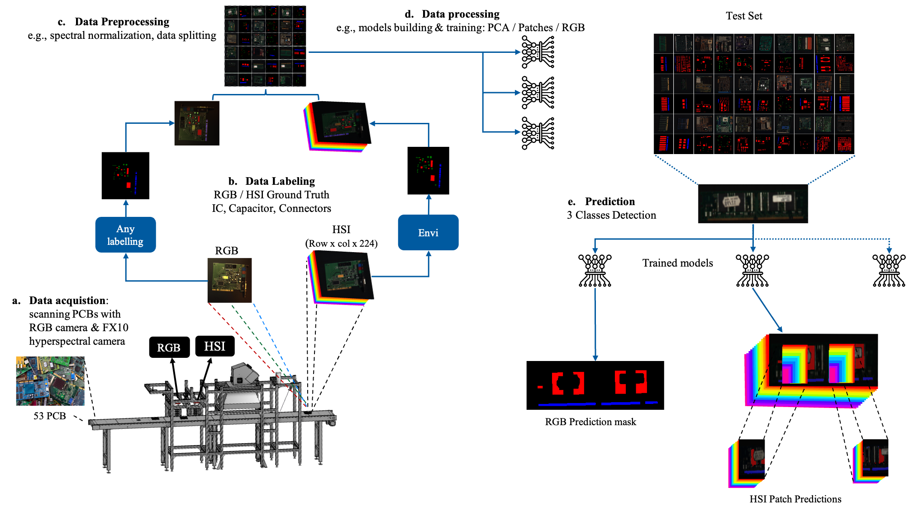
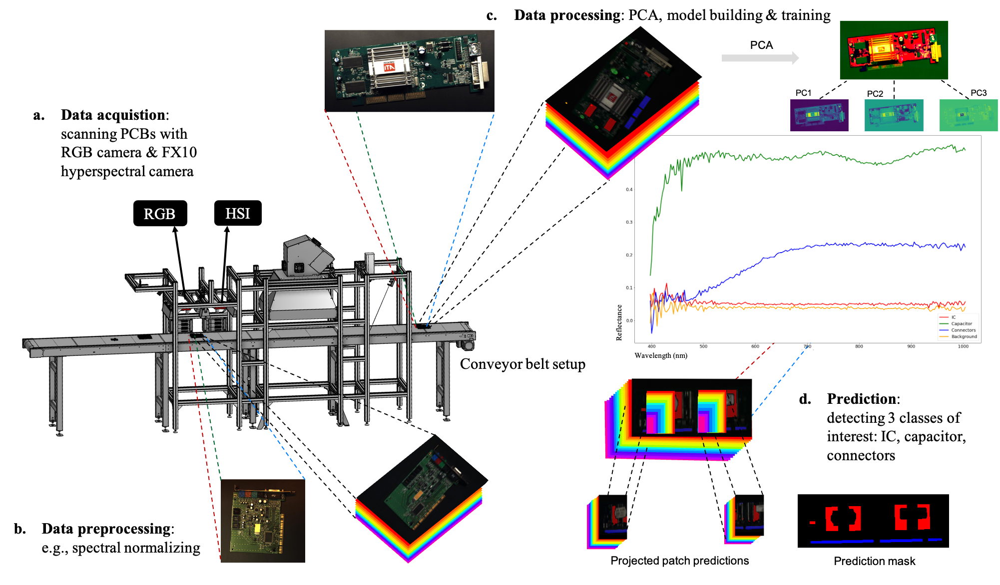
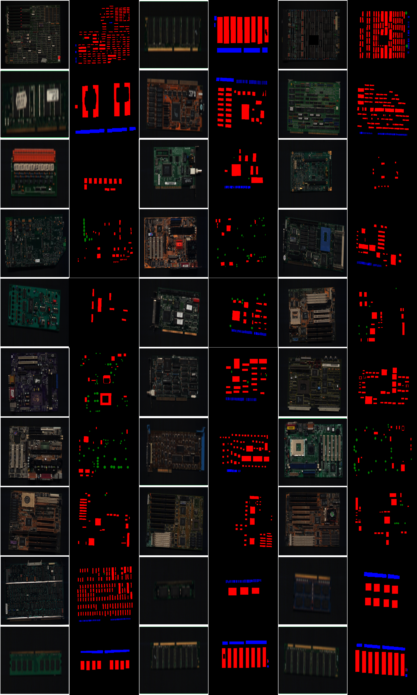

By Elias Arbash.

PCB-Vision is a 53-scene RGB + VNIR dataset of printed circuit boards (Specim FX10 and Teledyne Dalsa C4020), with General and Monoseg ground-truth masks for ICs, capacitors, connectors and other classes. Baseline models include U-Net, Attention U-Net, Res U-Net, DeepLabv3+ and LinkNet on RGB, PCA and 128³ patches.

- Paper: [arXiv:2401.06528](https://arxiv.org/pdf/2401.06528.pdf)
- Data: [Rodare 2704](https://rodare.hzdr.de/record/2704)
- Code: [github.com/hifexplo/PCBVision](https://github.com/hifexplo/PCBVision)

Funded by RAMSES-4-CE and CirculAIre. Contact: e.arbash@hzdr.de.

