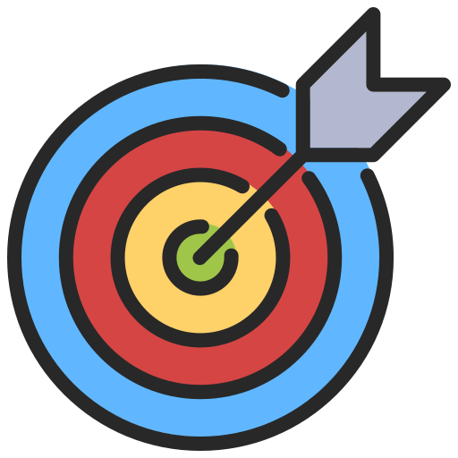
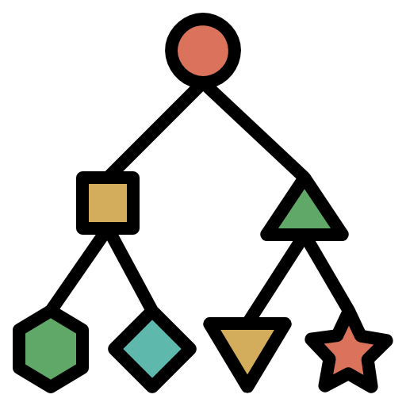
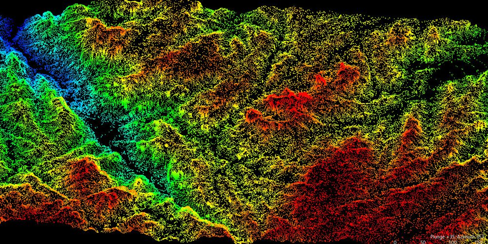
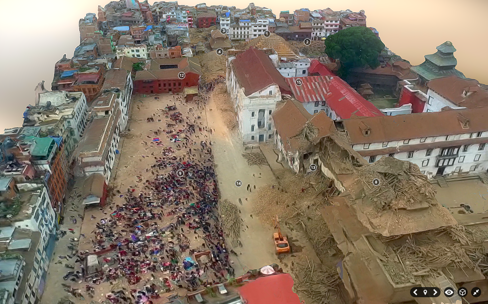
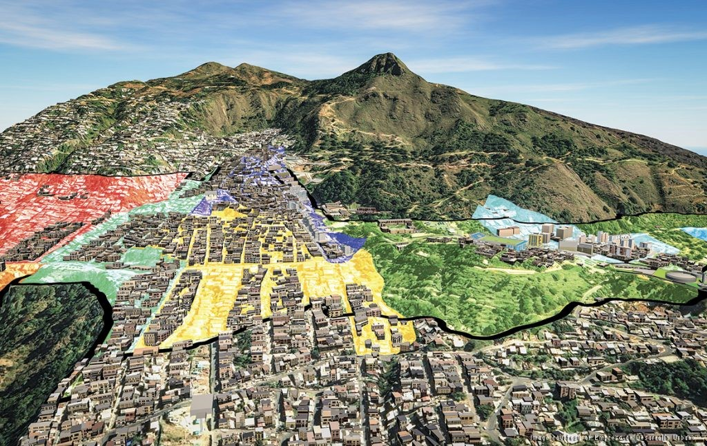
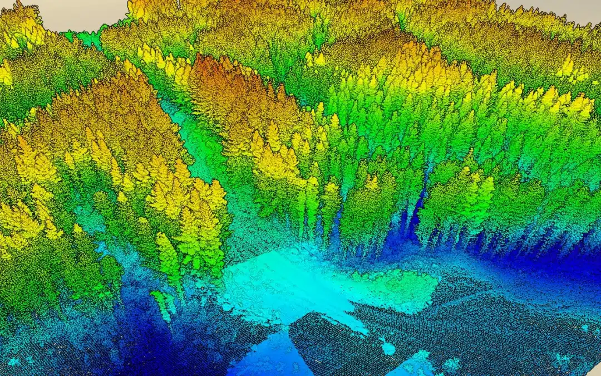
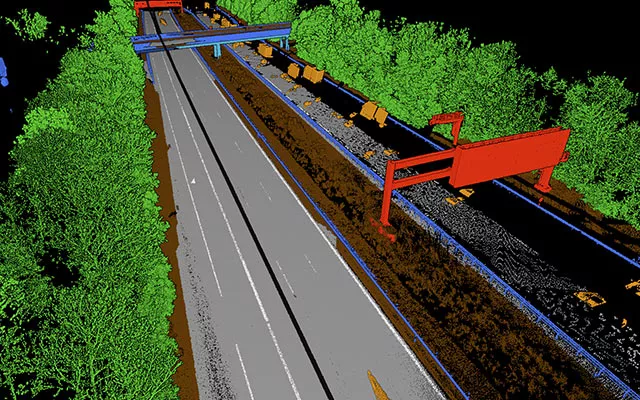

As LiDAR scanning technology grows more affordable, the once-complex realm of three-dimensional mapping is now within reach of everyone with an interest in the landscape around them. However, for newbies to LiDAR, the increased accessibility comes with the problem of understanding the complexities of "**point clouds**."

What precisely are point clouds?

What's the difference between LiDAR data and point clouds?

What are the benefits of point cloud surveys?

What distinguishes point cloud segmentation from classification?

What are the applications for point cloud data?

In this post, we will look at the most commonly asked questions concerning point clouds and provide you with all of the necessary information. We will also explore how advances in point cloud processing are making LiDAR more accessible. Here, we explain LiDAR and its relation to point clouds 👀.

So, what exactly is a point clouds?

In simpler terms, point cloud is a collection of data points in three-dimensional space that represent the shape, size, and location of objects or surfaces 👌🏿.

The points in a point cloud can be obtained through various High-tech technologies such as LIDAR scanning, photogrammetry, or 3D scanning. The data is defined as the x, y and z coordinates of thousands of points on the surface of an object.

Each of these points reveals something about the object's form and structure.Consider them tiny digital probes that capture every detail.

When we add RGB color values to these spots, we're essentially painting an image on each one. This color data transforms 3D point clouds into 4D, giving them visual richness and depth.

three-dimensional representation of an object or area from point cloud data

What are the advantages of doing point cloud surveys?

Point cloud surveys, an innovative and non-invasive mapping approach, provide several advantages over previous techniques. Let's get started go more into the following benefits 😎:

Precision

Point cloud surveys are completely accurate to the millimeter. This minimizes mapping mistakes, ensures cost management, and allows for rapid issue resolution in real-world projects, saving time, money, and energy.

Velocity

Conventional surveys take days or even hours to complete, but point cloud technology takes only a fraction of that time. It not only reduces disturbance, but also allows for faster access to critical design data.

Veracity

The collected extensive data about geometry, colors, and intensity may be utilized for a variety of applications, including geological mapping, architectural inspections and archeological studies.

Visualization

The use of 3D point clouds enables realistic and real-time visualizations. It allows specialists to investigate and examine surroundings and buildings from several perspectives.

LiDAR data vs point clouds

While LiDAR is a technique used to build point clouds, it is not the only way to do so. It works by producing laser pulses and measuring how long it takes for those pulses to bounce off objects and return to the sensor. LiDAR data consists of precise 3D spatial information expressed as a collection of space coordinates. It lacks color information (RGB values). Instead, it excels at capturing geometry, making it the preferred solution when pinpoint precision is required. In terms of precision, however, LiDAR is difficult to better.

Point clouds, for example, may be created from photographs captured with digital cameras using a method known as photogrammetry.

Point clouds ,on the other hand, have an RGB value for each point, resulting in a colored point cloud. The one distinction between point clouds and LiDAR is RGB. In other words, color.

While LiDAR is a popular way for making point clouds, it's important to remember that not all point clouds are made using LiDAR technology. For example, photogrammetry technique that uses digital camera photos, may also be used to create point clouds. The presence of RGB values for each point separates photogrammetric point clouds from those obtained from LiDAR data.

Nevertheless, LiDAR continues to be unsurpassed in terms of pinpoint precision. It shines in situations where precision is essential, such as topographic mapping, forestry management, and urban planning.

However, not all projects require the same level of precision, so it is always advisable to conduct some study before selecting which approach is ideal. It is necessary to consider both acquisition and processing times.

Point Clouds = LiDAR + RGB

What is the difference between point clouds segmentation and classification?

Point cloud segmentation and classification are both techniques employed to analyze and interpret 3D point cloud data, although they have different particular aims.

Classifcation

Each cloud point is assigned a single label.

This label indicates the category of the real-world object to which the point relates.

For instance, a point may be labeled as "ground," "building," "*car*," or "*tree*."

To make these categorizations, classification looks at the point cloud's global characteristics.

Segmentation

Groups points in the cloud together based on common attributes.

The purpose is to partition the point cloud into regions with all points belonging to the same category.

This category may be the same as classification, but it may also be more fine-grained, such as distinguishing between individual automobiles within a "car" cluster in classification.

Segmentation creates these segmented regions by combining the local properties of individual points with their interactions with nearby points.

𝑯𝒆𝒓𝒆'𝒔 𝒂𝒏 𝒂𝒏𝒂𝒍𝒐𝒈𝒚: 𝑰𝒎𝒂𝒈𝒊𝒏𝒆 𝒂 𝒑𝒐𝒊𝒏𝒕 𝒄𝒍𝒐𝒖𝒅 𝒐𝒇 𝒂 𝒄𝒊𝒕𝒚.

Classification would label each point as "building," "road," "tree," and so on.

Segmentation would recognize distinct buildings, separate roadways from walkways, and maybe discriminate between trees.

Simply said, classification organizes points into bins, whereas segmentation divides them into different forms or objects.

What are point clouds data used for ?

Architects, building firms, and other businesses rely on point cloud modeling because it can be used to create various sorts of models that are: Efficient: Instead of waiting for data to be processed, let the program do it for you. You may then submit it to your preferred software platform to obtain the necessary data and models.

Precision mapping surveying

https://djm-aerial.com/land-survey-topographical-point-cloud-lidar/Point cloud data creates super-detailed 3D maps of places, like landscapes and buildings. It's like having a laser-powered ruler and protractor. Land survey using drones Is becoming the go to choice for topographical surveys and spatial analysis including high resolution mapping and point cloud generation.

Disaster risk management

https://ieeexplore.ieee.org/document/8088136This 3D point cloud data, which is frequently collected via LiDAR or photogrammetry, helps in terrain evaluation, flood modeling, landslide prediction, earthquake preparedness, damage assessment, and search and rescue operations. This data enables authorities to make more informed decisions and efficiently control catastrophe risks.

Urban mobility

https://www.dlt.com/blog/2018/11/14/bim-dominates-winners-announced-aec-excellence-awards-2018In cities, point cloud data is used to create 3D representations of buildings, roads, and other structures. It informs us where everything is and how tall they are. This aids in the planning of city growth and functions as a blueprint for metropolitan regions. We can also identify areas that require repair or improvement. It's like being a city detective with a very precise 3D magnifying lens.

Forest management

https://interpine.nz/lidar-seeing-the-forest-for-the-trees/Point cloud data allows for the creation of comprehensive 3D representations of forests. It can see the trees, the little plants, and even the ground. This is a game changer in terms of forest management. We can track their health, decide when to take down trees for wood, and identify areas that require replacement. It's similar to performing a health check on woods

Intelligent transportation system

https://pointly.ai/use-case/the-automated-labeling-of-point-clouds-from-highway-scans/Point clouds can be fused with other sensors, such as IMUs or cameras or radars, to provide augmented information in the treatment and application of 3D data for intelligent transportation systems. This includes challenges with calibrating devices and building accurate 3D point clouds for high-level applications, such as localization, understanding scenes, and behavior analysis.

Point cloud data is used in a variety of applications, including directing robots, improving driver assistance systems, and building detailed 3D models. In essence, point cloud data is a computer representation of the physical world around us.

Point clouds are one of the sources utilized in geographic information systems to generate a digital elevation model of the landscape. They are also utilized to produce 3D models of urban settings.

