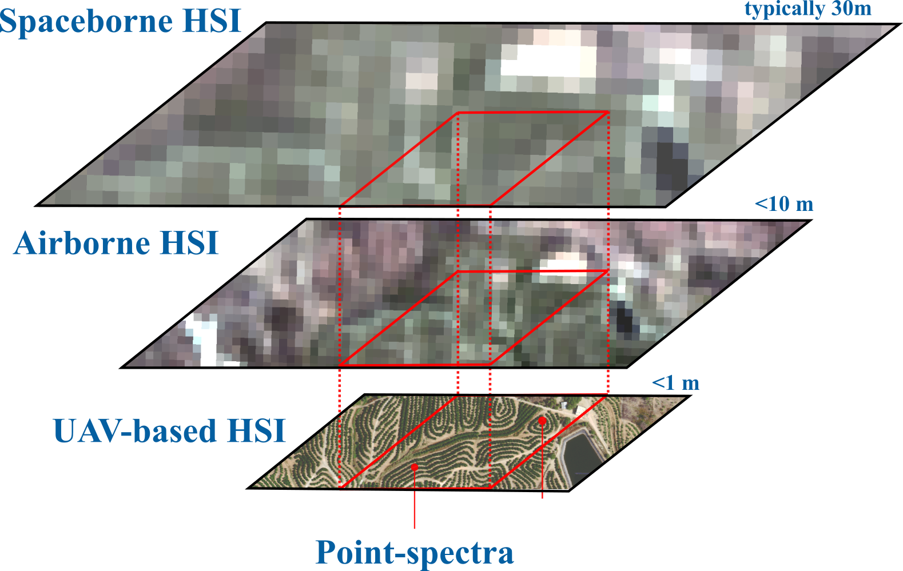

UAVs bridge ground versus airborne and satellite hyperspectral imaging. This CASUS Open Project develops methods to integrate and extrapolate across scales for mineral exploration and ecological parameter estimation: characterise spectral variations from ground to satellite, quantify linear and non-linear mixing with ground-sample distance, and explore super-resolution and generative enhancement.

See also the project page [HyperUAV](https://www.iexplo.space/hyperuav).

