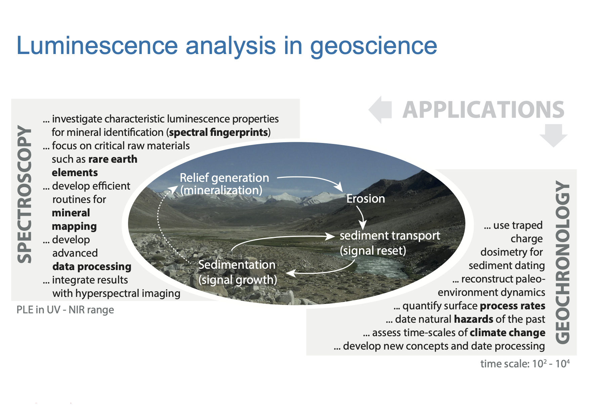
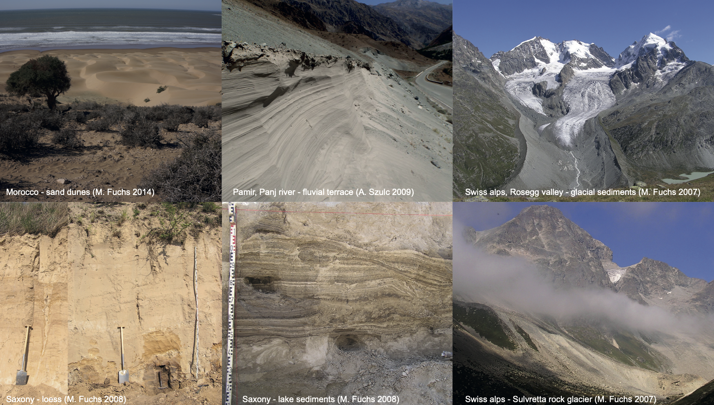
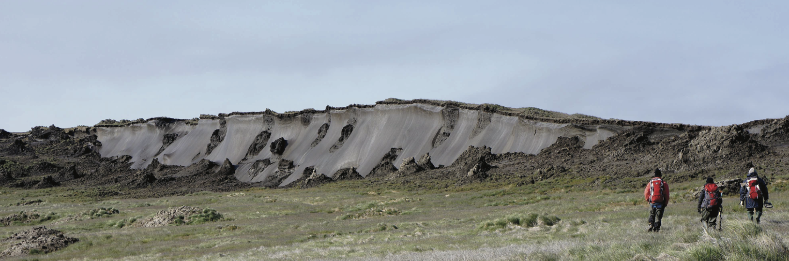
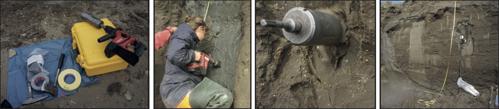

Joint infrastructure for methodological developments in geochronology and spectroscopy, including the R package *Luminescence*, the Sandbox toolkit, and DFG projects REPLAY and ARENICOLA (automated grain classification and multi-spectral deconvolution).

