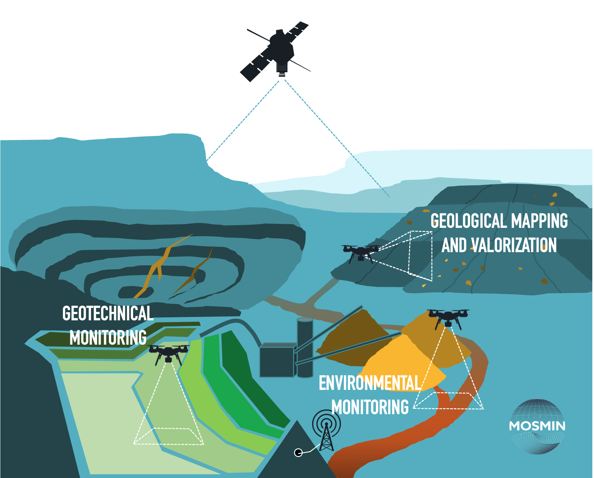

Holistic full-site services for geotechnical and environmental monitoring and valorisation of mining-related deposits, using Earth observation and in situ geophysics. Copernicus supports deformation and surface-composition mapping; UAV and in situ sensors, machine-learning fusion and resolution enhancement, and distributed fibre-optic sensing address the subsurface.

Goals include greener EO tools, lower environmental and safety risk, EU resilience via secondary critical raw materials, and ESG transparency. Project site: [mosmin.eu](https://www.mosmin.eu/).

