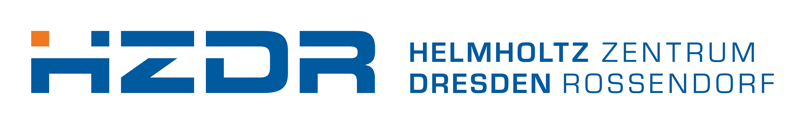
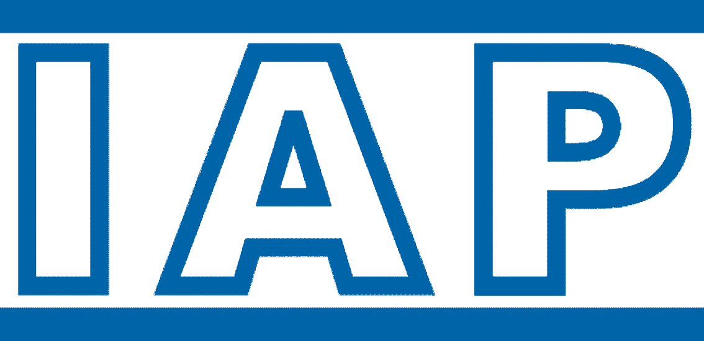
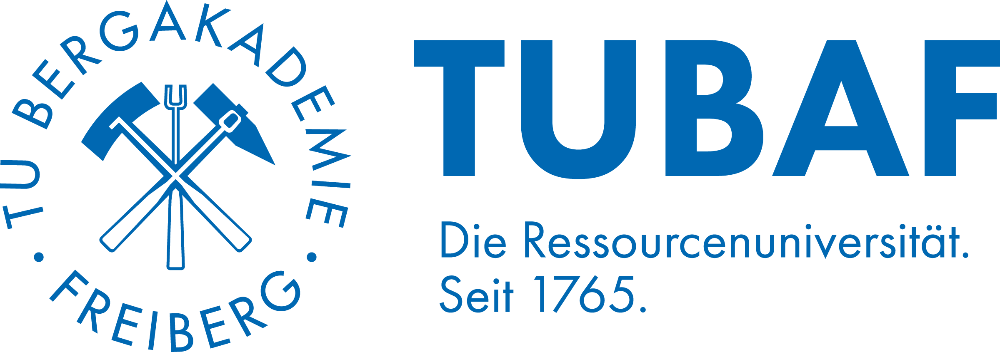
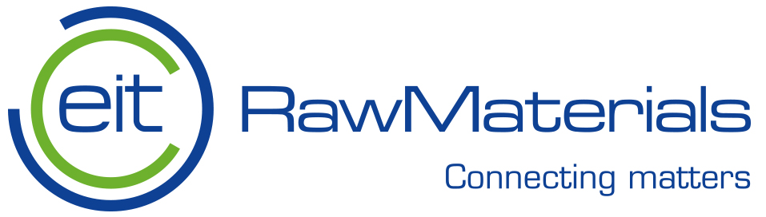
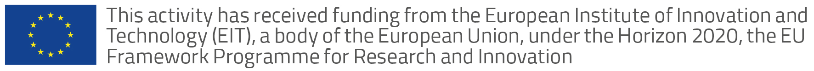
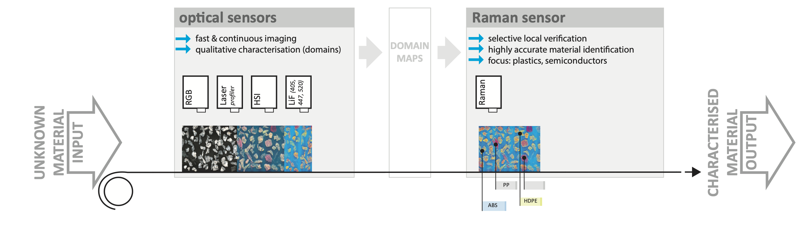
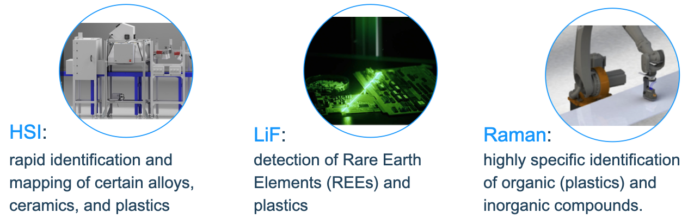
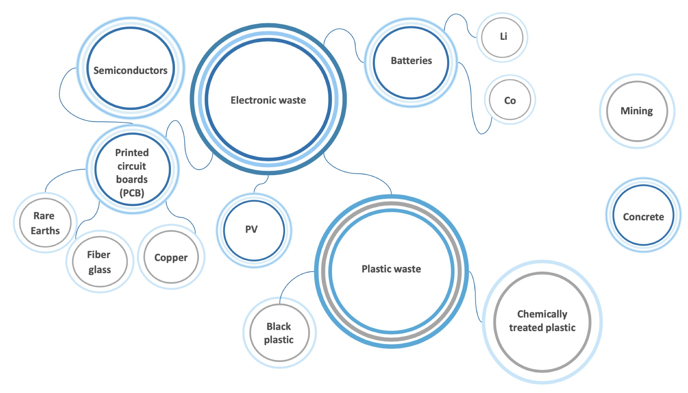

The rapid identification of critical compounds is crucial for adequate sorting and the adapted recycling that will enable a circular economy. RAMSES-4-CE is a four-year upscaling project funded by EIT RawMaterials to bring latest research into technical solutions for the resource industry. The project innovates optical spectroscopy-based multi-sensor systems for the recycling industry.

We address this challenge by using a combination of imaging sensors to identify key chemical compounds in material streams. Hyperspectral (HSI) reflectance spectroscopy in the near- and mid-infrared can identify and classify certain alloys, ceramics, and plastics. Laser-induced fluorescence (LiF) spectroscopy enables the detection of rare-earth elements and low-reflective black plastics, among others. To increase the range of waste classes, we add a rapid, non-destructive Raman sensor, integrated into the existing LiF and HSI system developed during inSPECtor.

Data are processed and analysed immediately using machine learning, so that the fully integrated sensor network can operate in sequential component-mapping mode with immediate data fusion.

