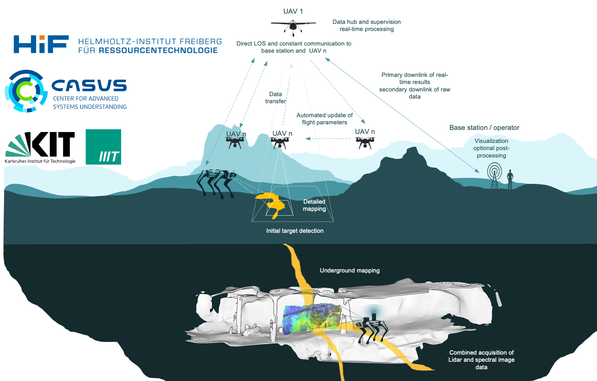
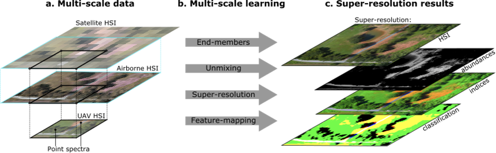

Autonomous platforms allow us to deploy innovative sensor technology in otherwise inaccessible regions. Unmanned aerial vehicles support high-resolution mapping of remote exploration areas, steep cliffs, or active open-pit mines. Terrestrial robots help explore confined or hazardous spaces such as underground mines and tunnels.

As part of our mission to operationalise non-invasive material mapping, we combine autonomous platforms with Earth observation technology. That means addressing technical compatibility of hyperspectral and geophysical payloads, data quality under complex conditions, and rapid processing of large datasets. We also research collaborative data collection by task-distributed drone swarms, adapted sensor design, autonomous validation, real-time hypercloud processing, and navigation that uses hyperspectral information.

## Research focus

**Innovative drone platforms.** For flexibility and interoperability with different payloads, we design, manufacture and program drone platforms in our in-house DroneLab. Payloads include hyperspectral cameras in the visible, near- and shortwave infrared, thermal cameras, magnetometers, radiometers and lidar. We also develop novel airframes and share some systems as open hardware.

**Processing workflows for innovative sensors.** Custom payloads challenge the availability of reliable geometric and radiometric correction. We contribute open tools including MEPHySTo (frame-based hyperspectral), hylite (pushbroom hyperspectral, nadir and oblique), and the MAGNETO toolbox (magnetic and radiometric data), and we integrate surface spectroscopy with subsurface geophysics (Mulsedro, MOSMIN).

**Multiscale mapping.** Drone data bridges satellite or airborne remote sensing (pixels of several to tens of metres) and sparse but detailed ground observations. Through HyperUAV we study scale effects on spectral derivatives, compare sensors and platforms, and develop super-resolution and generative enhancement — with applications to critical-raw-material exploration (for example REE-bearing carbonatites) and mine-site monitoring (MOSMIN).

**Autonomous acquisition.** AutoTarget develops a task-distributed drone network that combines long-endurance light systems with heavy-duty sensor platforms. In parallel we are autonomising mapping routines for shafts and tunnels: the terrestrial robot platform REX carries a hyperspectral camera and laser scanner, and the first underground recordings have been demonstrated.

