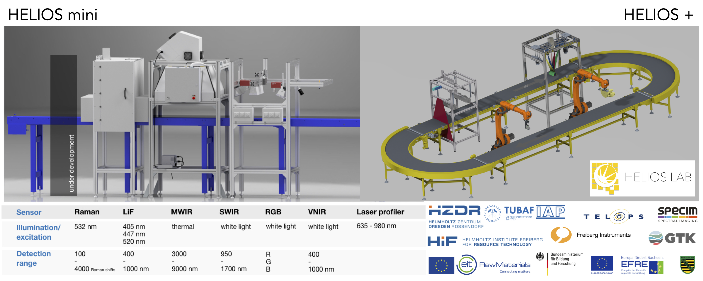

Optical sensors have become key to most on- and in-line scanning applications in material characterisation, digitalisation, and monitoring. They offer non-invasive sensing to identify the composition of primary and secondary materials without time- and cost-consuming sample preparation and chemical analyses. Based on material-specific physical properties, such sensors provide huge advantages for a selected material group, but show limitations for materials beyond that group, as well as for complex or unknown, variable material streams.

To innovate available technology, overcome limitations of individual sensors and expand the range of detectable materials, we focus on (1) the development of new, tailored sensor solutions and on (2) the integration of sensors into smart and agile networks. In particular, we combine reflectance hyperspectral imaging (HSI) sensors from VNIR to LWIR with emission spectroscopy using laser-induced fluorescence (LiF) to map material types and their abundances. We investigate further integration concepts for refining position information in 3D (RGB, laser profiler) for improved signal acquisition. We evaluate how resulting data can enable efficient control mechanisms and guide subsequent sensors in automated analysis cycles for validation and updating mapping results. Developed concepts then allow the toolkit of sensors (for example Raman, XRF or LIBS) to expand within the network according to the scope of individual research questions and application cases.

## Research focus

The HELIOS lab is a research infrastructure to explore the potentials and limits of optical sensors for raw material identification. The concept of HELIOS represents a combination of the EYES with the BRAIN. The EYES are our sensors to record selected physical parameters and the BRAIN provides an efficient and learning data processing architecture. Developments provide technical concepts for operational conditions and workflows for real-time data processing as a basis for process control and monitoring.

- Sensor development and integration for innovative concepts in material-stream characterisation and digitalisation in real time
- Laser-induced fluorescence (LiF) line-scan sensor integrated with HSI (inSPECtor) for drill cores
- Raman sensor for point validation integrated within HSI and LiF networks (RAMSES-4-CE)
- In-line spectroscopy-based sensor networks for HSI, LiF, Raman, XRF and LIBS
- Infrastructure for battery recycling (XRF, LIBS, robots, conveyor, GPU; InfraDatRec)
- High-performance computing (GPU, CirculAIre)

**Primary raw materials**, especially critical raw materials in drill cores and re-mining material, including rare-earth elements (inSPECtor, RAMSES-4-CE).

**Secondary raw materials**, especially complex, variable waste streams:

- automated material detection in e-waste recycling (RAMSES-4-CE)
- battery recycling (DIGISORT, RegioREC, RESTORE)
- electrolyser recycling (AI4H2 / ReNaRe / H2Giga)
- automotive recycling (Car2Car, KOLLEKT)
- additives in polymer recycling (FINEST)

## Research infrastructure

Multi-sensor work started with HELIOS mini in 2018 (RGB, HSI and LiF covering VNIR, SWIR and MWIR). Activities expanded in 2023 with robots, a laser profiler, Raman, XRF and LIBS in the circular HELIOS+ setup. LUNA lab provides further luminescence spectroscopy for dosimetric and geoscientific method development.

